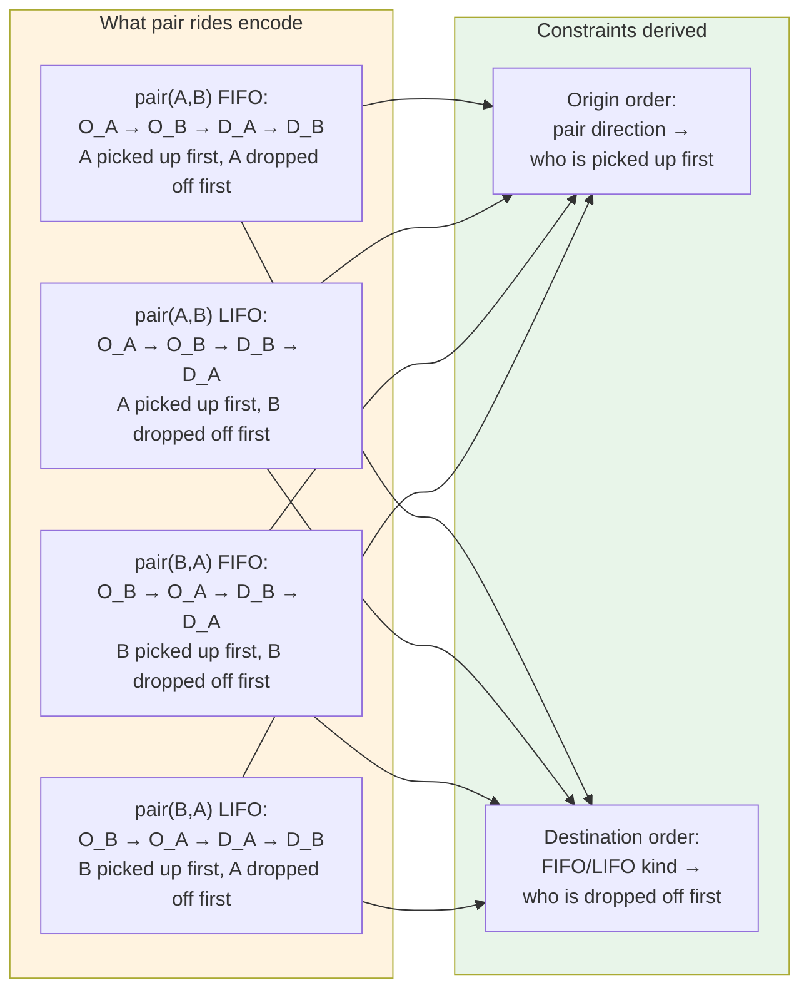
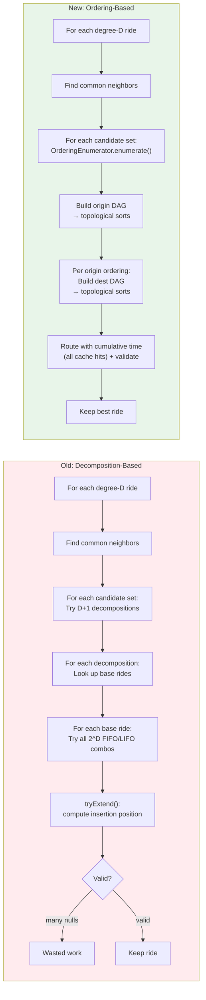
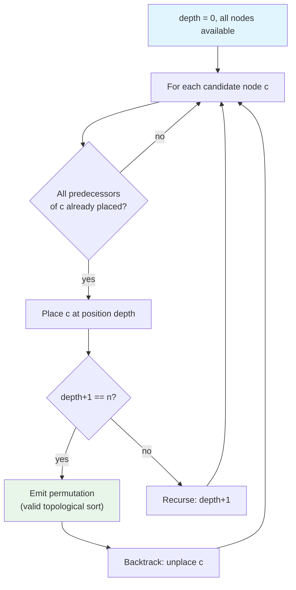

# Ordering-Based Extension Algorithm — Diagram

## Algorithm Overview (per degree D → D+1)

```mermaid
flowchart TD
    subgraph INPUT["Input"]
        DR["Degree-D rides<br/>(1 per request set, from previous degree)"]
    end

    DR --> ENUM["Extract unique base sets<br/>(D request indices each)"]

    ENUM --> NEIGHBOR["For each base set:<br/>findCommonNeighborsSorted()<br/>→ candidate new requests"]

    NEIGHBOR --> NEWSET["Form degree-(D+1) candidate set<br/>[base indices + new request], sorted"]

    NEWSET --> DEDUP{"processedSetHashes<br/>.add(hash)?"}
    DEDUP -- "already seen" --> SKIP["Skip (dedup)"]
    DEDUP -- "new set" --> PAIRS

    subgraph CONSTRAINT_EXTRACTION["1. OrderingEnumerator.enumerate()"]
        PAIRS["Extract pairwise constraints<br/>Query graph for all C(D+1,2) pairs<br/>in BOTH directions"]
        PAIRS --> PAIRCHECK{"Any pair<br/>disconnected?"}
        PAIRCHECK -- "yes" --> INFEASIBLE["Skip (infeasible set)"]
        PAIRCHECK -- "no" --> PAIRINFO["PairInfo[] array:<br/>per pair: fwd/rev FIFO, fwd/rev LIFO"]
    end

    subgraph ORDERING_ENUM["2. Ordering Enumeration"]
        PAIRINFO --> ORIG_DAG["Build origin constraint DAG:<br/>• forwardOnly(A,B) → A before B<br/>• reverseOnly(A,B) → B before A<br/>• bidirectional → no edge"]
        ORIG_DAG --> ORIG_TOPO["Enumerate all topological sorts<br/>of origin DAG<br/>(backtracking search)"]
        ORIG_TOPO --> FOR_ORIG["For each origin ordering:"]
        FOR_ORIG --> DEST_DAG["Build dest constraint DAG:<br/>Origin order fixes pair direction →<br/>• FIFO only → same-direction dest edge<br/>• LIFO only → reverse-direction dest edge<br/>• both FIFO+LIFO → no edge"]
        DEST_DAG --> DEST_CHECK{"Direction has<br/>pair rides?"}
        DEST_CHECK -- "no rides for<br/>this direction" --> INVALID_ORIG["Skip origin ordering<br/>(invalid for this pair)"]
        DEST_CHECK -- "yes" --> DEST_TOPO["Enumerate all topological sorts<br/>of destination DAG"]
    end

    subgraph EVALUATION["3. Ride Evaluation (per ordering)"]
        DEST_TOPO --> ORDERING["Resolve int[] perms → DrtRequest[]<br/>requests = originsOrdered"]
        ORDERING --> SEQUENCE["Build stop sequence:<br/>[O₁, O₂, ..., Oₙ, D₁, D₂, ..., Dₙ]"]
        SEQUENCE --> ROUTE["Route all 2n−1 segments<br/>cumulative departure time<br/>(all cache hits from pair rides)"]
        ROUTE --> ROUTE_CHECK{"All segments<br/>reachable?"}
        ROUTE_CHECK -- "no" --> SKIP_ORD["Skip ordering"]
        ROUTE_CHECK -- "yes" --> METRICS["Calculate per-passenger metrics:<br/>travel time, distance, delay"]
        METRICS --> BUDGET{"Per-passenger<br/>maxTravelTime<br/>satisfied?"}
        BUDGET -- "no" --> SKIP_ORD
        BUDGET -- "yes" --> DELAY["Optimize delays<br/>(LP feasibility)"]
        DELAY --> DELAY_CHECK{"Delay<br/>feasible?"}
        DELAY_CHECK -- "no" --> SKIP_ORD
        DELAY_CHECK -- "yes" --> VALIDATE["BudgetValidator:<br/>check utility budgets"]
        VALIDATE --> BUDGET_CHECK{"Budget<br/>feasible?"}
        BUDGET_CHECK -- "no" --> SKIP_ORD
        BUDGET_CHECK -- "yes" --> OBJECTIVE["Compute objective value"]
    end

    subgraph SELECTION["4. Best Ride Selection"]
        OBJECTIVE --> COMPARE{"Better than<br/>current best<br/>for this set?"}
        COMPARE -- "yes" --> UPDATE["Update bestRide"]
        COMPARE -- "no" --> NEXT["Try next ordering"]
        UPDATE --> NEXT
    end

    NEXT --> |"more orderings"| ORDERING
    NEXT --> |"all orderings tried"| STORE

    STORE{"bestRide<br/>found?"} -- "yes" --> RESULT["Store in resultBySetHash"]
    STORE -- "no" --> NEXTSET["Next candidate set"]
    RESULT --> NEXTSET

    NEXTSET --> |"more candidates"| NEWSET
    NEXTSET --> |"all done"| OUTPUT["Output: List<Ride><br/>(1 per feasible set)"]

    style INPUT fill:#e1f5fe
    style CONSTRAINT_EXTRACTION fill:#fff3e0
    style ORDERING_ENUM fill:#f3e5f5
    style EVALUATION fill:#e8f5e9
    style SELECTION fill:#fce4ec
```



## Pair Ride Semantics



## Old vs New Algorithm Comparison



## Topological Sort Enumeration (Backtracking)



## Concrete Example: Degree 3 (Requests A, B, C)

```
Shareability graph edges:
  pair(A,B) FIFO ✓  LIFO ✓     → bidirectional origin, no dest constraint
  pair(B,C) FIFO ✓  LIFO ✗     → B before C (origin), D_B before D_C (dest)
  pair(C,A) FIFO ✗  LIFO ✓     → C before A (origin), D_A before D_C (dest)
  (reverse directions: none)

Origin DAG:
  B → C (forwardOnly)
  C → A (forwardOnly)
  A↔B (bidirectional, no constraint)

Valid origin orderings (topological sorts):
  [B, C, A]  ← only valid sort

For origin [B, C, A]:
  pair(A,B): B before A → reverse direction → check reverse FIFO/LIFO
  pair(B,C): B before C → forward direction → FIFO only → D_B before D_C
  pair(C,A): C before A → forward direction → LIFO only → D_A before D_C

Dest DAG:
  B → C  (from pair(B,C) FIFO)
  A → C  (from pair(C,A) LIFO: D_A before D_C... wait, C first, LIFO → D_A before D_C)

Valid dest orderings: depends on A↔B constraint from reverse pair rides

Stop sequence: [O_B, O_C, O_A, D_?, D_?, D_?]
  → Route all 5 segments (cache hits) → validate → keep best
```
