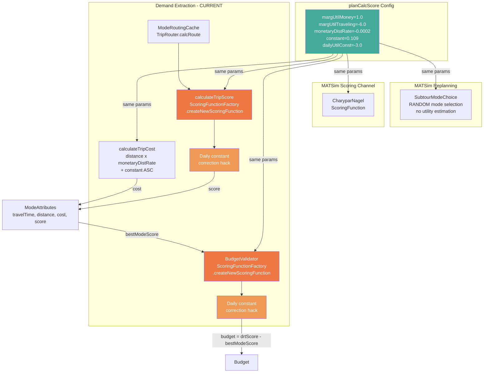
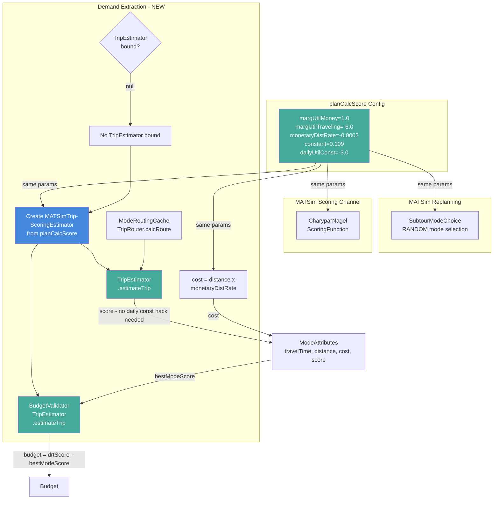
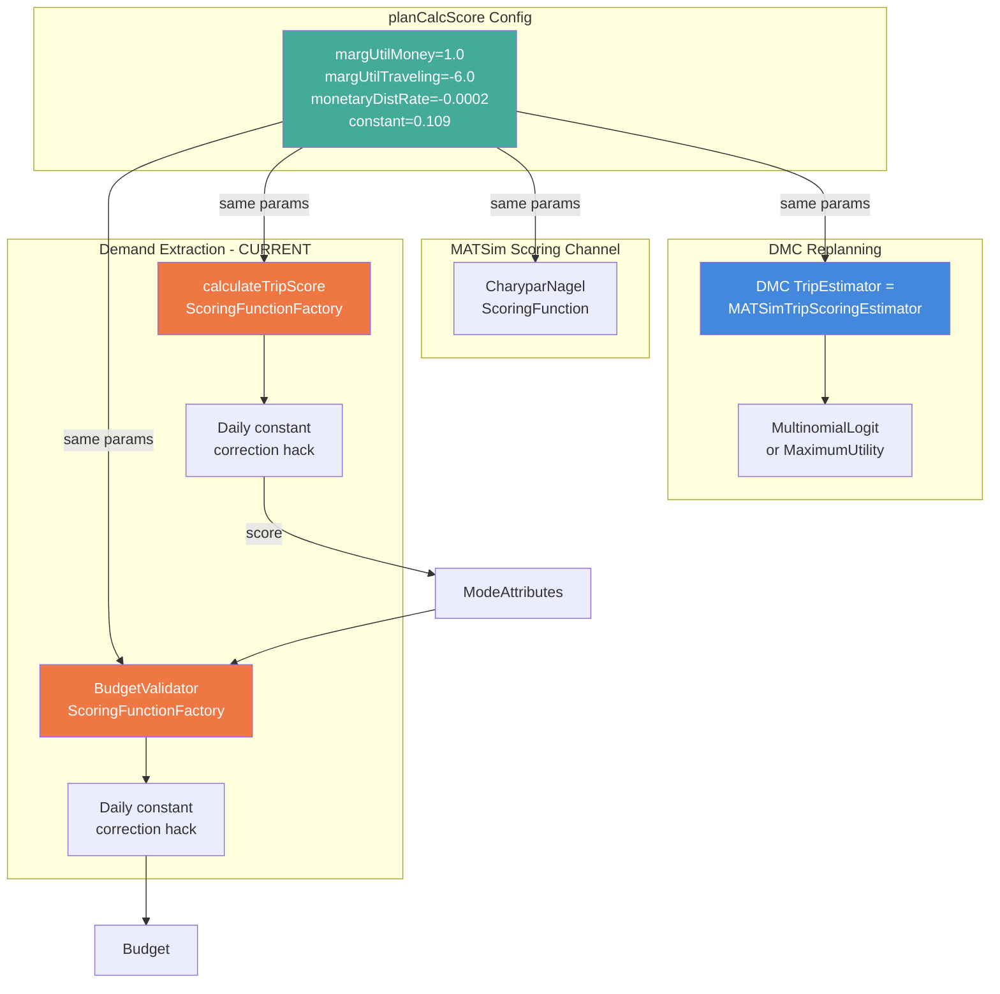
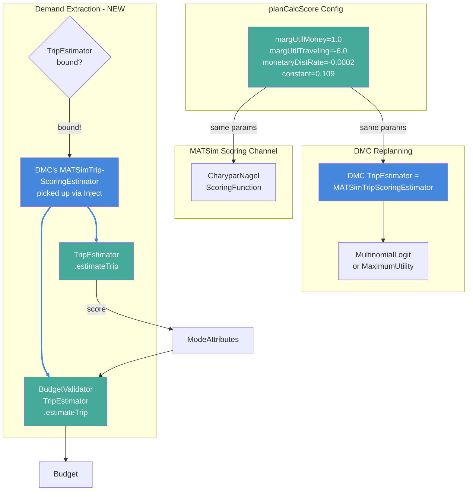
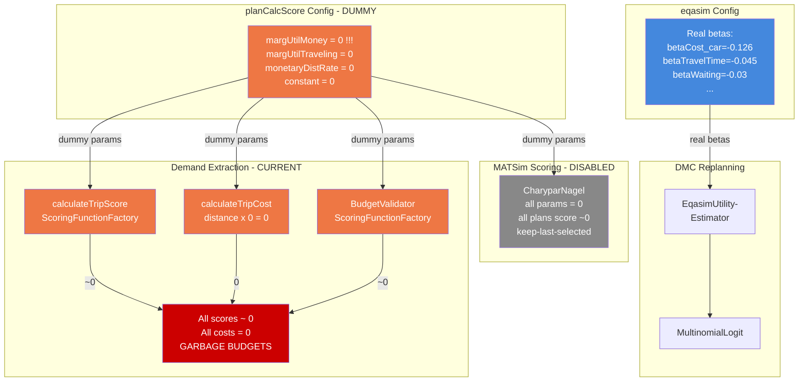
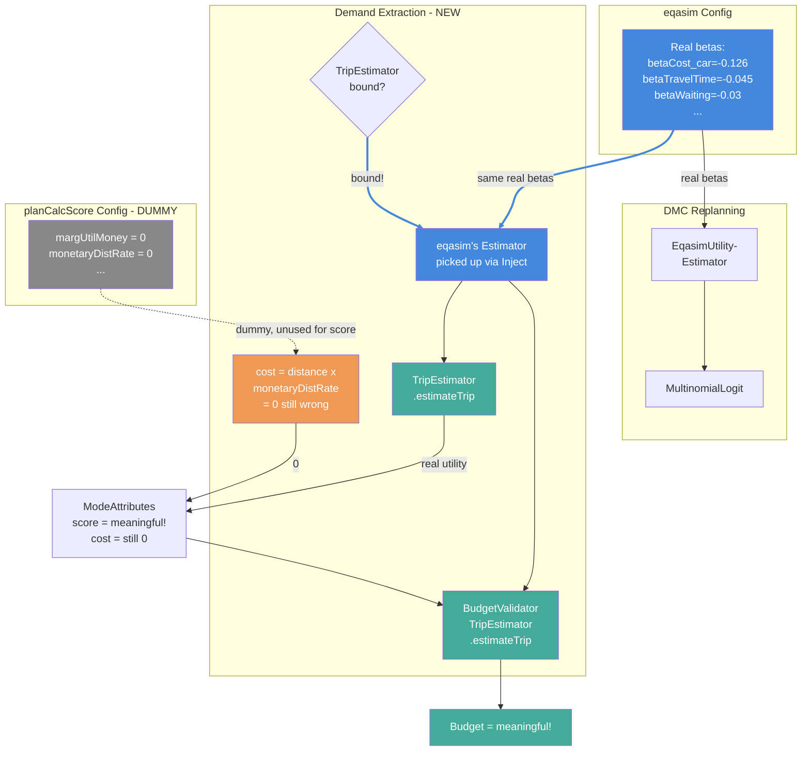
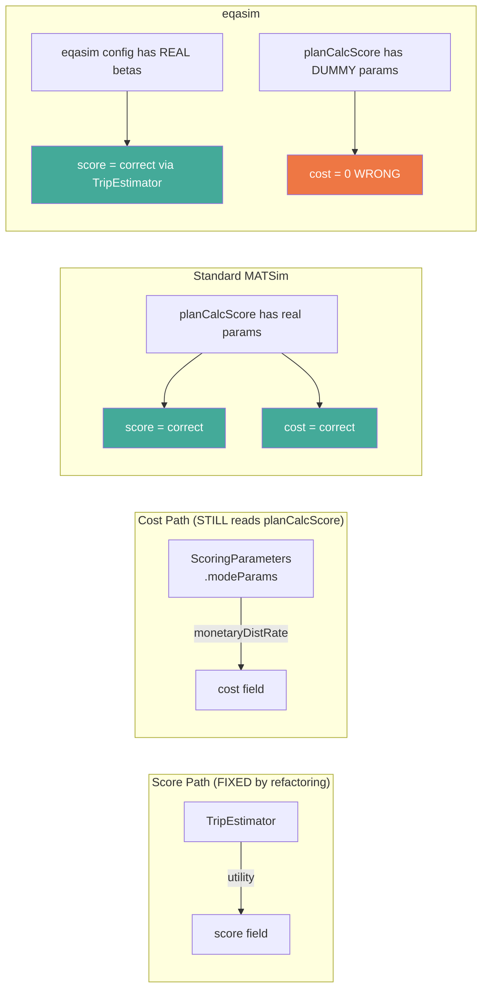
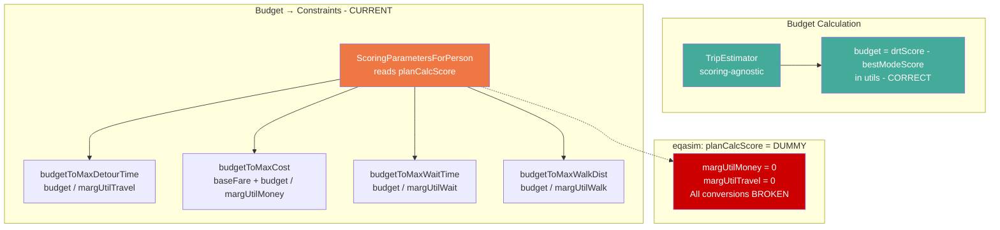
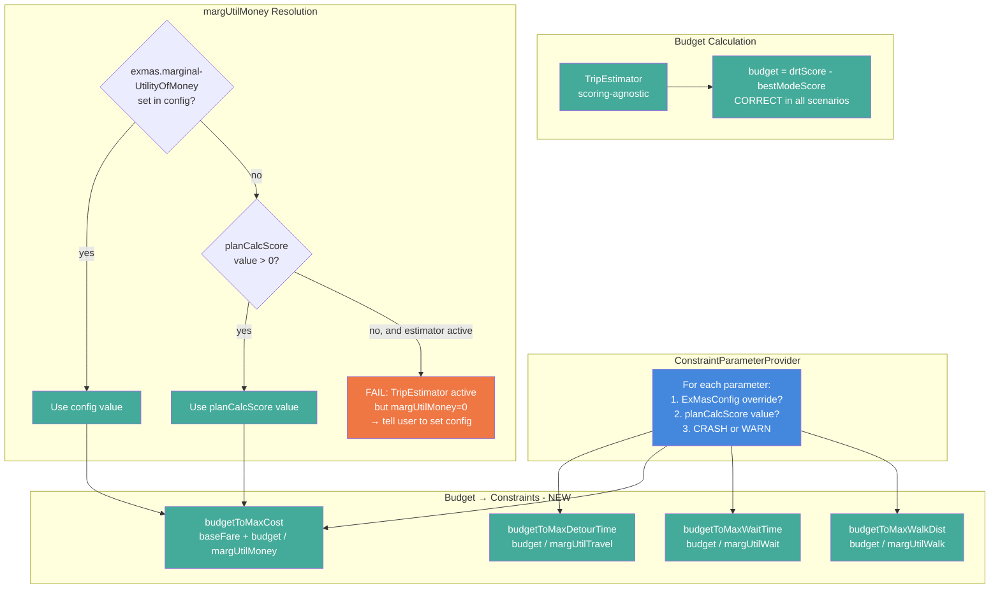
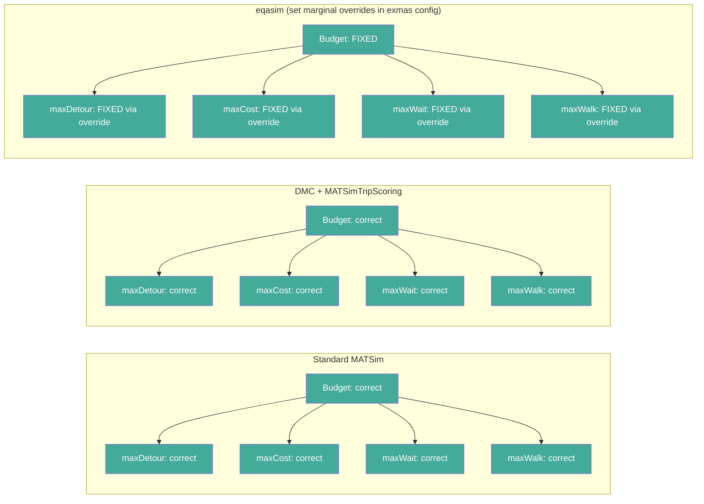

# Scoring-Agnostic Pipeline Diagrams

## Scenario 1: Standard MATSim (no DMC)

### Current Pipeline (ScoringFunction)

**Result: CORRECT.** All components read from the same `planCalcScore` params. The daily constant hack is ugly but produces correct trip-level utilities. Score and cost both derive from the same source.

---

### After Refactoring (TripEstimator)

**Result: CORRECT.** `MATSimTripScoringEstimator` reads from `planCalcScore` — same params as before. No daily constant hack needed (TripEstimator excludes them by design). Identical budgets, cleaner code.

---

## Scenario 2: DMC + MATSimTripScoring

### Current Pipeline (ScoringFunction)

**Result: CORRECT but inconsistent.** DMC uses `MATSimTripScoringEstimator` (reads `planCalcScore`), CharyparNagel reads `planCalcScore`, demand extraction reads `planCalcScore`. All same params. But demand extraction goes through ScoringFunction (with hack) while DMC goes through TripEstimator (clean). Same result, different paths.

---

### After Refactoring (TripEstimator)

**Result: CORRECT and CONSISTENT.** Demand extraction now uses the EXACT SAME TripEstimator instance as DMC replanning. Same code path, same params, no hack. Budgets reflect exactly how DMC evaluates modes.

---

## Scenario 3: eqasim

### Current Pipeline (ScoringFunction) — BROKEN

**Result: BROKEN.** Demand extraction reads from `planCalcScore` (dummy: everything=0). eqasim's real betas are in a completely separate config that demand extraction never sees. All budgets are ~0 → no meaningful DRT demand.

The cost field is ALSO broken: `distance × 0 = 0`. No monetary cost information.

---

### After Refactoring (TripEstimator) — FIXED

**Result: SCORE is FIXED, COST is still broken.** The `score` now comes from eqasim's TripEstimator (real betas) → meaningful budgets. But `cost` still reads from `planCalcScore` dummy params → always 0.

**This is the residual cost problem:** You cannot extract the monetary component from a TripEstimator's utility output without knowing the estimator's internal pricing model. The TripEstimator returns a single utility number — it doesn't decompose it into "time part + money part + comfort part".

---

## The Cost Problem — Visual Summary

---

## Decision: Remove Cost Field from ModeAttributes

`ModeAttributes.cost` was analytics-only (CSV output), never used in budget calculation, and broken (included ASC as monetary cost). With the scoring-agnostic refactoring, the TripEstimator's `score` field captures ALL utility components including monetary costs. The `cost` field is removed entirely.

---

## Full Pipeline: Budget to Constraints (The Heart of the Methodology)

### Current — Reads planCalcScore Directly (Broken in eqasim)

### After Refactoring — Perturbation-Based Extraction

### What Each Scenario Gets

