# DRT Demand Extraction Architecture

Comprehensive documentation of the MATSim DRT demand extraction pipeline
including the ExMAS ride generation algorithm and all optimization mechanisms.

## 1. Pipeline Overview

The pipeline extracts DRT-eligible trips from a MATSim simulation, computes
utility budgets against baseline modes, and generates a database of feasible
shared rides at increasing pooling degrees.

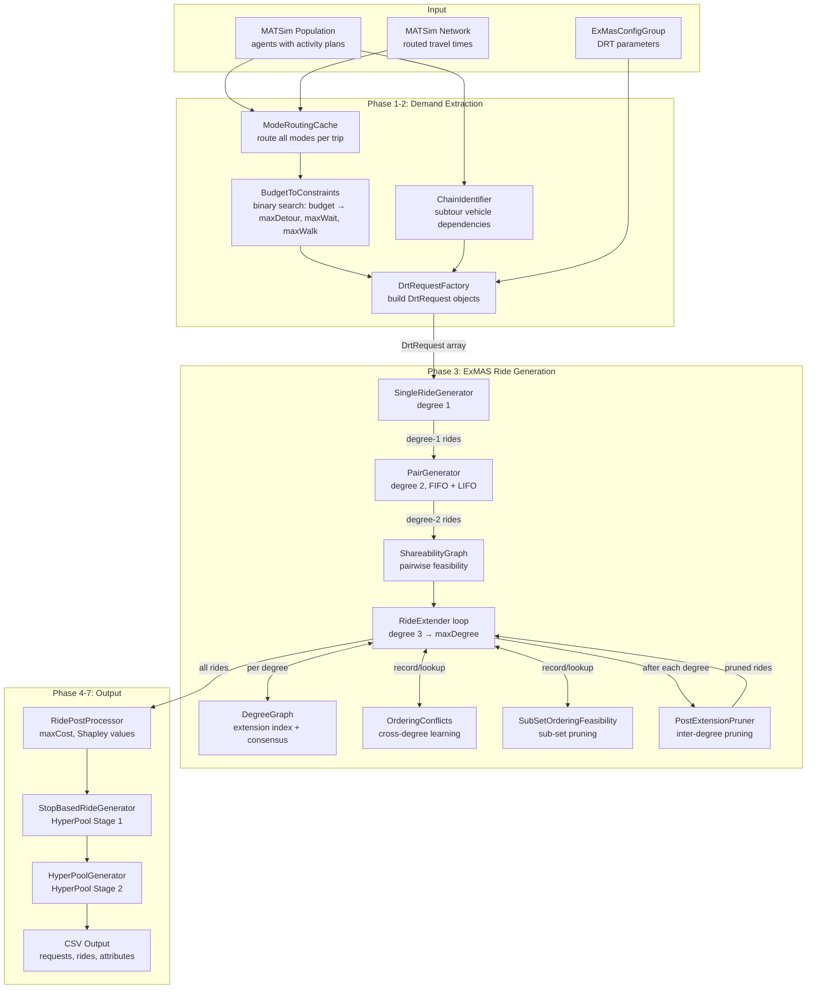

## 2. Budget and Constraint Derivation

Each trip's utility budget determines what level of DRT service the agent
would accept. Constraints are derived from the budget via binary search.

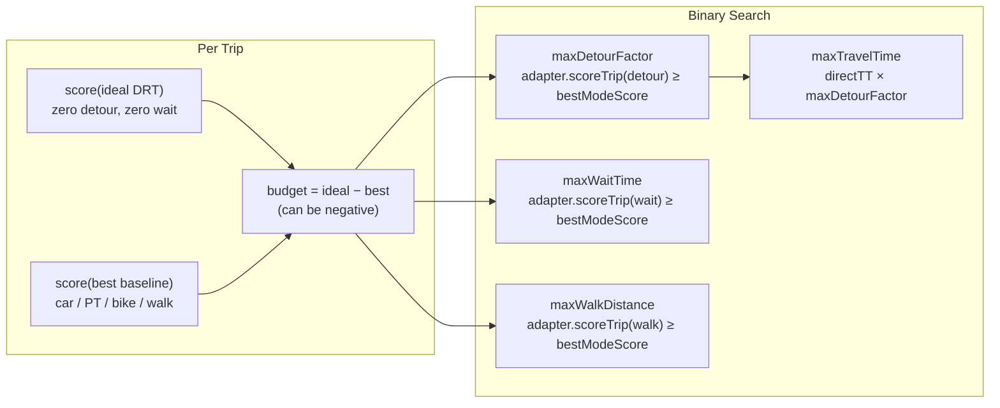

## 3. Degree-by-Degree Extension Loop

The core loop generates rides at increasing pooling degrees. Each degree
builds on the previous degree's rides and graph structures.

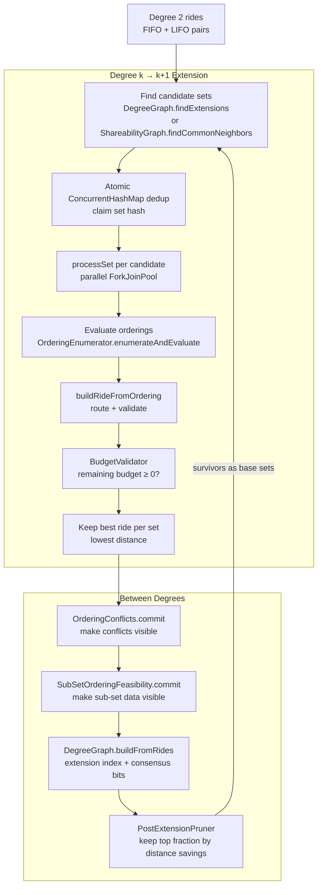

## 4. Pairwise Constraint Extraction

For each candidate set, pairwise constraints from degree-2 rides determine
which orderings are topologically valid.

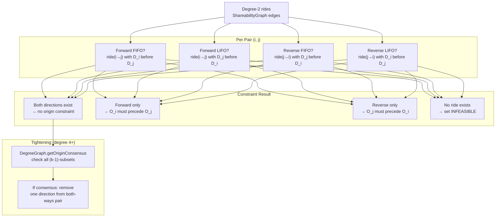

## 5. Set Evaluation Decision Tree

This is the core per-set evaluation showing every check, constraint, and
pruning mechanism in the order they are applied.

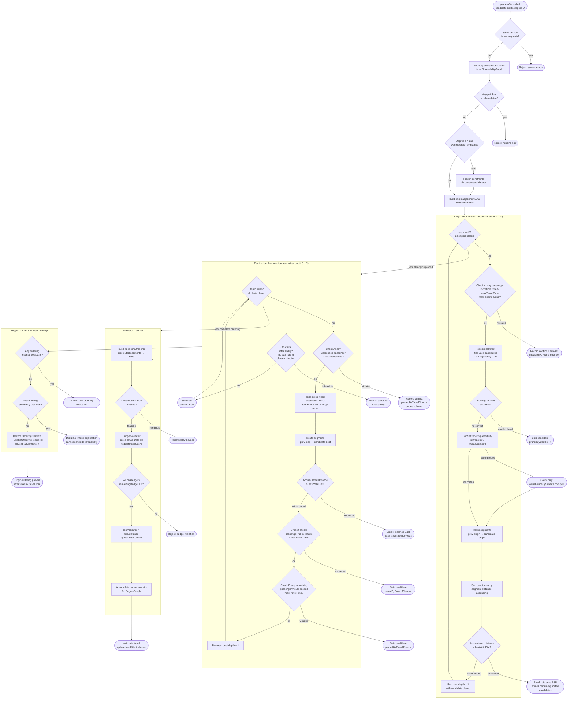

## 6. Sub-Set Ordering Feasibility (Enhancement)

The sub-set ordering feasibility mechanism replaces the sparse cross-set
conflict approach with direct lookups using pre-computed degree-k data.

### 6.1 Core Insight

Every degree-7 set has C(7,3) = 35 triple sub-sets. We already computed
valid rides for ALL of them at degree 3. For each triple, we know exactly
which of the 3! = 6 origin orderings are infeasible.

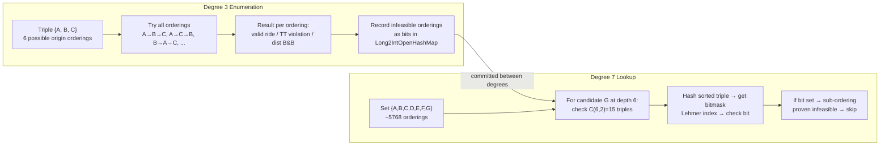

### 6.2 Recording Triggers

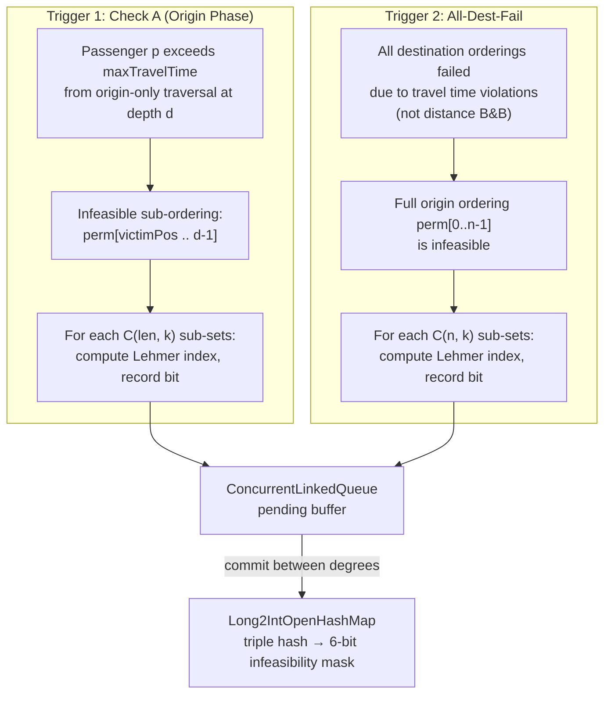

### 6.3 Data Structure

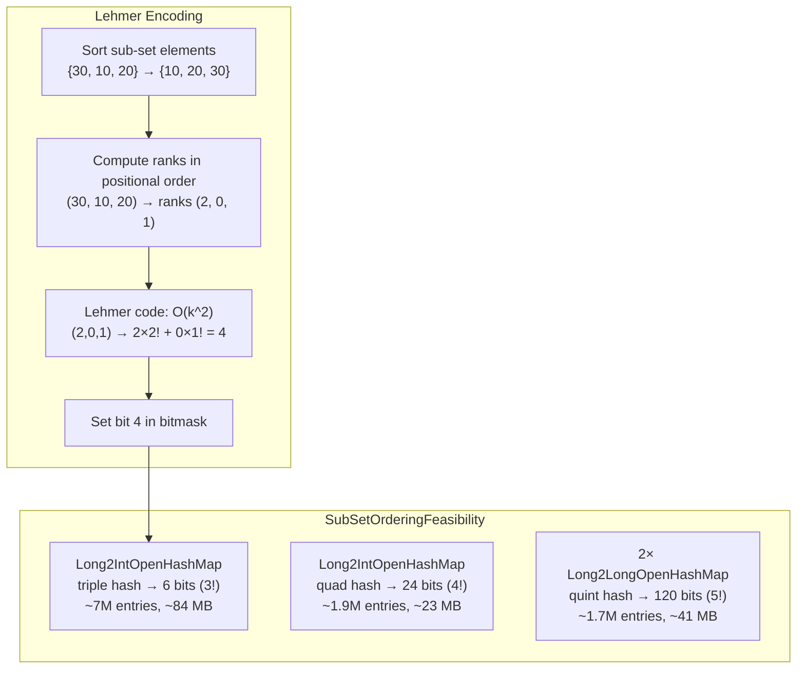

### 6.4 Lookup Cost per Candidate

| Sub-set size | Lookups at depth d | Cost per lookup | Example: depth 6 |
|:---:|:---:|:---:|:---:|
| Triples (k=3) | C(d, 2) | ~30ns: hash + map get + bit test | 15 lookups |
| Quads (k=4) | C(d, 3) | ~40ns | 20 lookups |
| Quints (k=5) | C(d, 4) | ~50ns | 15 lookups |

Compare: `OrderingConflicts.hasConflict` is O(2^d) subsequence checks at depth d.

## 7. Cross-Degree Data Flow

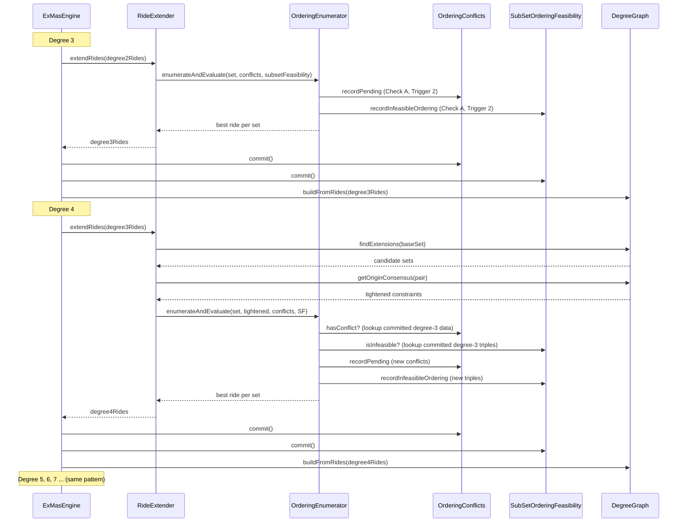

## 8. Pruning Mechanisms Summary

All pruning mechanisms ordered by when they apply during set evaluation:

```mermaid
flowchart TD
    subgraph "Pre-Enumeration"
        P1["Same-person filter<br/>O(D^2) per set"]
        P2["Missing-pair filter<br/>O(D^2) constraint extraction"]
        P3["Consensus tightening<br/>DegreeGraph reduces DAG"]
    end

    subgraph "Origin Phase"
        P4["Topological filter<br/>DAG adjacency check"]
        P5["Check A: origin-only TT<br/>prunes entire subtree"]
        P6["OrderingConflicts lookup<br/>O(2^d) subsequence match"]
        P7["SubSetOrderingFeasibility<br/>O(C(d,2)) triple lookup"]
        P8["Distance B&B<br/>sorted candidates, break on exceed"]
    end

    subgraph "Destination Phase"
        P9["Structural infeasibility<br/>no pair ride in chosen direction"]
        P10["Check A: undropped pax TT<br/>prunes subtree"]
        P11["Distance B&B<br/>sorted candidates, break on exceed"]
        P12["Dropoff check: pax full TT<br/>skip candidate"]
        P13["Check B: remaining pax TT<br/>skip candidate"]
    end

    subgraph "Evaluation Phase"
        P14["Delay optimization<br/>feasibility check"]
        P15["Budget validation<br/>remainingBudget ≥ 0"]
        P16["Bound tightening<br/>bestValidDist ← ride.distance"]
    end

    subgraph "Post-Extension"
        P17["Trigger 2 recording<br/>all-dest-fail → learn conflicts"]
        P18["Inter-degree pruning<br/>keep top fraction"]
    end

    P1 --> P2 --> P3
    P3 --> P4 --> P5 --> P6 --> P7 --> P8
    P8 --> P9 --> P10 --> P11 --> P12 --> P13
    P13 --> P14 --> P15 --> P16
    P16 --> P17 --> P18
```

### Pruning effectiveness (10% Bavaria, 21k requests)

| Mechanism | Degree 5 | Degree 6 | Degree 7 |
|:---|:---:|:---:|:---:|
| Consensus tightening | moderate | strong | very strong |
| Check A (origin phase) | 1.7x speedup | 1.7x | 1.7x |
| Distance B&B | dominant deg3-4 | moderate | minor |
| Dropoff check | 93.5% of dest failures | 93.5% | 93.5% |
| Trigger 2 learning | recording only | recording | recording |
| Sub-set lookup | **TBD (measuring)** | **TBD** | **TBD** |

## 9. Complete Pipeline Timing (10% Bavaria, degrees 3-7)


The factorial wall on orderings per set dominates at high degrees:

| Degree | Avg orderings/set | Typical candidates | Wall-clock time |
|:---:|:---:|:---:|:---:|
| 3 | 2-6 | ~473k sets | 23s |
| 4 | 3-18 | ~180k sets | 10s |
| 5 | 4-40 | ~95k sets | 31s |
| 6 | 15-200 | ~45k sets | 124s |
| 7 | 100-9000 | ~18k sets | 405s |

## 10. Output Schema

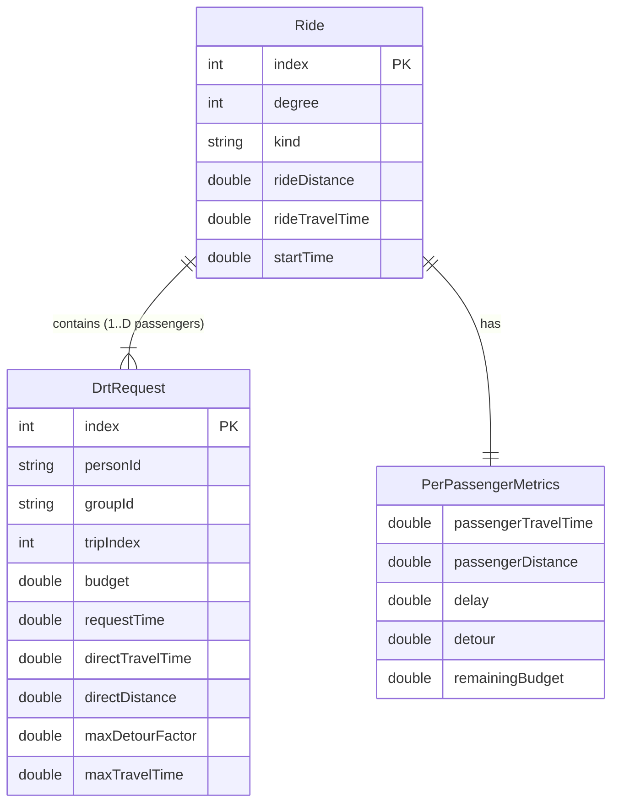

### Output files

| File | Content | Consumer |
|:---|:---|:---|
| `drt_requests.csv` | One row per DRT-eligible trip with budget | ExmasCommuters (Python MIP) |
| `exmas_rides.csv` | One row per feasible shared ride | ExmasCommuters (Python MIP) |
| `person_attributes.csv` | Demographics for clustering | SimWrapper visualization |
| `connection_cache.csv` | Predecessor/successor links | Empty vehicle routing |

## 11. Worked Example: 4 Requests Through Degree 1–4

This section traces four DRT requests through every phase of the algorithm,
visualizing DAGs, orderings, pruning checks, and cross-degree learning.

### 11.1 Setup: Four Requests Along a Corridor

```
West ──────────────────────────────────────────────────── East

  O_A ───5km──── O_B ───3km──── O_C ───4km──── O_D
  8:00           8:02           8:04           8:05

                    D_B                D_D
                    │ 6km               │ 5km
                    ▼ south             ▼ south
        D_A                 D_C
        │ 8km               │ 9km
        ▼ south             ▼ south
```

| Request | Origin | Dest | Depart | directTT | maxDetourFactor | maxTravelTime |
|:---:|:---:|:---:|:---:|:---:|:---:|:---:|
| **A** | O_A | D_A | 8:00 | 10 min | 1.5 | **15 min** |
| **B** | O_B | D_B | 8:02 | 7 min | 1.6 | **11.2 min** |
| **C** | O_C | D_C | 8:04 | 11 min | 1.5 | **16.5 min** |
| **D** | O_D | D_D | 8:05 | 6 min | 1.8 | **10.8 min** |

### 11.2 Degree 1: Single Rides

Each request gets a direct (unshared) ride. Budget validation computes
`remainingBudget = score(DRT direct) − score(best baseline mode)`.

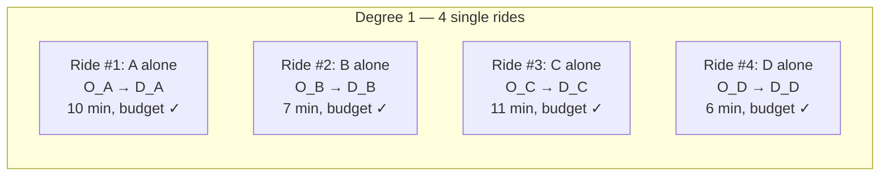

**Output:** 4 single rides, all pass budget validation.

### 11.3 Degree 2: Pair Generation

The PairGenerator tries every pair in both directions (A first vs B first)
and both kinds (FIFO = first-in-first-out, LIFO = last-in-first-out).

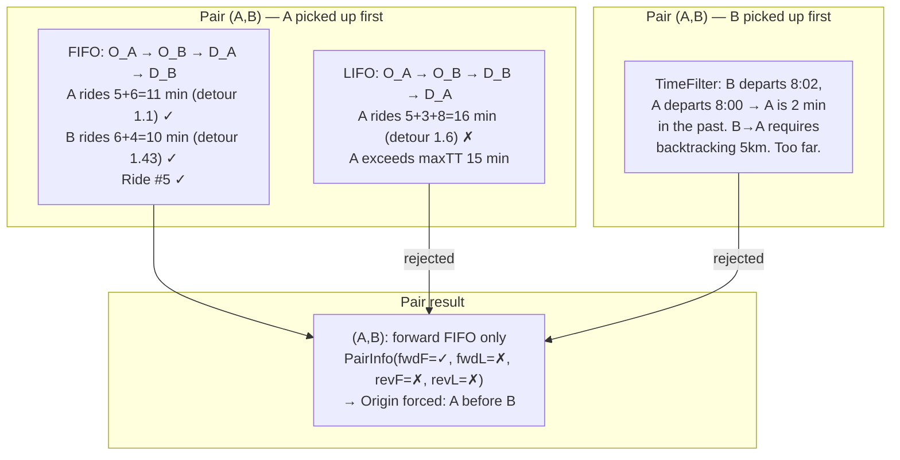

All six pairs are evaluated. Here are the results:

| Pair | A→B FIFO | A→B LIFO | B→A FIFO | B→A LIFO | PairInfo | Origin constraint |
|:---:|:---:|:---:|:---:|:---:|:---:|:---:|
| **(A,B)** | ✓ | ✗ | ✗ | ✗ | (T,F,F,F) | **A before B** |
| **(A,C)** | ✓ | ✗ | ✓ | ✗ | (T,F,T,F) | none |
| **(A,D)** | ✓ | ✗ | ✓ | ✗ | (T,F,T,F) | none |
| **(B,C)** | ✓ | ✗ | ✗ | ✗ | (T,F,F,F) | **B before C** |
| **(B,D)** | ✓ | ✓ | ✓ | ✗ | (T,T,T,F) | none |
| **(C,D)** | ✓ | ✗ | ✓ | ✗ | (T,F,T,F) | none |

**Output:** 10 pair rides (some pairs produce rides in both directions), all pass budget.

### 11.4 Shareability Graph

The shareability graph stores which pairs are feasible and with what kind.
Edges are directional: edge (A→B, FIFO) means "ride with A first, FIFO dropoff."

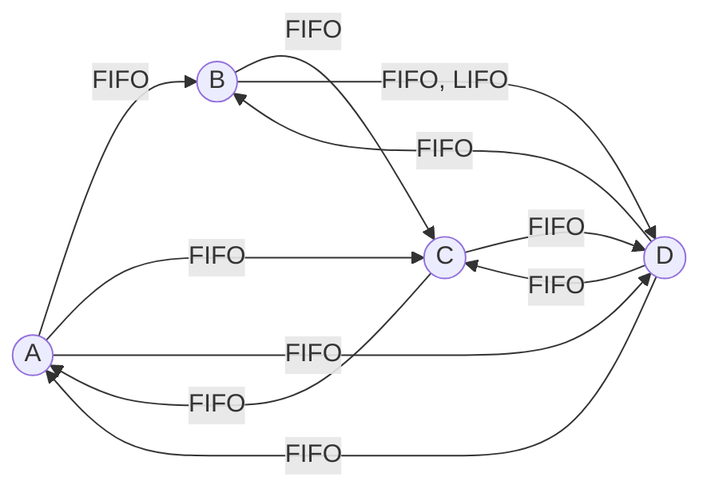

Key observations:
- **A→B exists but B→A does not** → A must always be picked up before B
- **B→C exists but C→B does not** → B must always be picked up before C
- **All other pairs** have edges in both directions → no forced origin order

### 11.5 Degree 3: Triple Enumeration

#### 11.5.1 Candidate generation

At degree 3, candidates are found via `ShareabilityGraph.findCommonNeighbors`.
A triple {X,Y,Z} is a candidate if all three pairs (X,Y), (X,Z), (Y,Z) have
at least one shared ride.

All 4 triples are feasible: **{A,B,C}**, **{A,B,D}**, **{A,C,D}**, **{B,C,D}**

#### 11.5.2 Triple {A, B, C} — Constrained DAG

**Step 1: Build origin DAG from pairwise constraints**

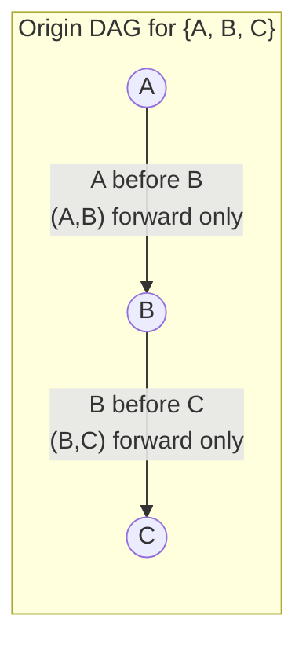

The DAG forces a single topological sort: **A → B → C**. Only 1 origin ordering.

**Step 2: Build destination DAG for origin [A, B, C]**

For each pair, the destination constraint depends on the chosen origin direction:

| Pair | Origin order | Direction | Available kinds | Dest constraint |
|:---:|:---:|:---:|:---:|:---:|
| (A,B) | A before B | forward | FIFO only | **D_A before D_B** |
| (A,C) | A before C | forward | FIFO only | **D_A before D_C** |
| (B,C) | B before C | forward | FIFO only | **D_B before D_C** |

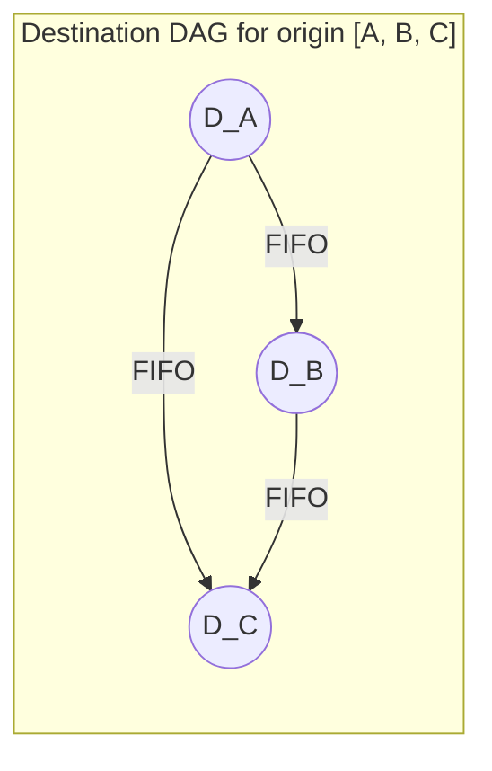

Only 1 valid destination ordering: **D_A → D_B → D_C**

**Step 3: Evaluate the single complete ordering**

```
Route: O_A → O_B → O_C → D_A → D_B → D_C
         5min   3min   7min   3min   4min
```

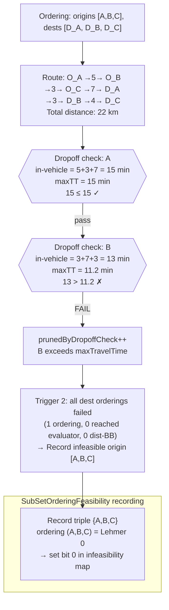

**Result:** {A,B,C} produces **0 valid rides**. The origin ordering is
recorded as infeasible in `SubSetOrderingFeasibility`.

#### 11.5.3 Triple {A, C, D} — Unconstrained DAG, Multiple Orderings

**Step 1: Origin DAG** — All three pairs allow both directions → empty DAG.

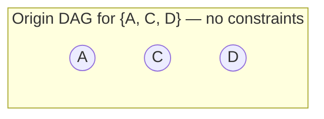

All 3! = **6 origin orderings** are topologically valid:
`[A,C,D]  [A,D,C]  [C,A,D]  [C,D,A]  [D,A,C]  [D,C,A]`

**Step 2: Branch-and-bound tree for origin enumeration**

The origin enumeration is a depth-first search tree. At each depth, candidates
are sorted by routed distance from the previous origin. The accumulated
`partialDist` is tracked. When it exceeds `bestValidDist`, all remaining
(sorted) candidates at that depth are pruned via `break`.

The bound `bestValidDist` starts at the maximum allowed ride distance (∞) and
**tightens only when a fully valid ride is found** (passes all checks + budget).

Segment distances for this example:

| From → To | Distance | Travel time |
|:---|:---:|:---:|
| O_A → O_C | 8 km | 10 min |
| O_A → O_D | 12 km | 15 min |
| O_C → O_A | 8 km | 10 min |
| O_C → O_D | 4 km | 5 min |
| O_D → O_A | 12 km | 15 min |
| O_D → O_C | 4 km | 5 min |


**Reading the tree:**
- Each node shows the origin ordering built so far, the accumulated `partialDist`,
  and whether it passes the distance bound check.
- Green leaves (✅) are orderings that produced valid rides.
- Red leaves (❌) show the specific check that pruned the ordering.
- At depth 1, candidates are **sorted by segment distance** — cheaper candidates
  are explored first, finding good bounds early.
- The bound tightens to **21 km** after the first valid ride [A,C,D].
  All subsequent branches with `partialDist > 21` would be pruned by `break`.
  In this example, no branch actually exceeds 21 in the origin phase — the
  bound's full power shows at degree 4+ where origin distances grow.

**Key property:** Because candidates are sorted by distance at each depth
and the bound only decreases, the `break` statement prunes not just the
current candidate but **all remaining candidates** at that depth (they are
guaranteed to have equal or larger distance). This is what makes it a
proper branch-and-bound, not just branch-and-check.

**Step 3: Check A during origin enumeration**

Two orderings are pruned by Check A before destination enumeration starts.
This is an **absolute** constraint (maxTravelTime is fixed per passenger),
unlike the distance B&B which uses a **relative** bound.

Detailed trace for ordering [D, C, A]:

```mermaid
flowchart TD
    CHECK["Origin depth 2: perm = [D, C, A]<br/>D picked up at 8:05 (requestTime)<br/>O_D →5min→ O_C →10min→ O_A"]
    
    CA_D{{"Check A: D's in-vehicle time<br/>= time(O_D→O_C) + time(O_C→O_A)<br/>= 5 + 10 = 15 min<br/>D's maxTT = 10.8 min<br/>15 > 10.8 ✗"}}
    
    PRUNE["prunedByTravelTime++<br/>D already busted from origins alone<br/>no destination ordering can help"]
    
    RECORD["Record sub-set infeasibility:<br/>perm[0..2] = [D, C, A]<br/>Triple {A,C,D} ordering (D,C,A) = Lehmer 5<br/>→ set bit 5 in infeasibility map"]
    
    CHECK --> CA_D -->|"FAIL"| PRUNE --> RECORD
```

**Step 4: Summary of all 6 orderings for {A,C,D}**

| # | Origin ordering | partialDist | Dest result | Status |
|:---:|:---|:---:|:---|:---|
| 1 | A, C, D | 12 km | dest [D_A, D_C, D_D] ✓ | **Valid ride, totalDist = 21km. Bound tightens.** |
| 2 | A, D, C | 16 km | D fails dropoff check | ❌ Dropoff |
| 3 | C, D, A | 16 km | — | ❌ Check A: D at 20 min > 10.8 |
| 4 | C, A, D | 20 km | dest [D_C, D_A, D_D] ✓ | **Valid ride, totalDist = 23km** (not best) |
| 5 | D, C, A | 12 km | — | ❌ Check A: D at 15 min > 10.8 |
| 6 | D, A, C | 20 km | D fails dropoff check | ❌ Dropoff |

The B&B tree explored all 6 origin orderings (none exceeded the 21km bound
in the origin phase alone). The pruning came from Check A (absolute travel
time) and the dropoff check (during destination enumeration).

At higher degrees, the distance B&B becomes dominant: with 5+ origins,
the partial distance from a bad first-origin choice quickly exceeds the
bound, pruning entire subtrees before any routing of later origins.

**Best ride for {A,C,D}:** ordering #1, distance 21km.

#### 11.5.4 Degree-3 results summary

| Triple | Origin orderings | Evaluated | Valid rides | Best dist |
|:---:|:---:|:---:|:---:|:---:|
| {A,B,C} | 1 | 1 | 0 | — |
| {A,B,D} | 2 | 3 | 1 | 19km |
| {A,C,D} | 6 | 4 | 2 | 21km |
| {B,C,D} | 3 | 5 | 2 | 18km |

### 11.6 SubSetOrderingFeasibility After Degree 3

After `commit()`, the infeasibility map contains:

| Triple (sorted) | Hash | Infeasible bits | Infeasible orderings |
|:---:|:---:|:---:|:---|
| {A,B,C} | h₁ | `000001` | (A,B,C) = Lehmer 0 |
| {A,C,D} | h₂ | `100100` | (A,D,C) = Lehmer 1, (D,C,A) = Lehmer 5 |
| {A,B,D} | h₃ | `010000` | (B,D,A) = Lehmer 4 |

```mermaid
flowchart LR
    subgraph "Long2IntOpenHashMap (triples)"
        H1["hash({A,B,C}) → 0b000001<br/>bit 0 set: (A,B,C) infeasible"]
        H2["hash({A,C,D}) → 0b100100<br/>bit 2: (A,D,C) infeasible<br/>bit 5: (D,C,A) infeasible"]
        H3["hash({A,B,D}) → 0b010000<br/>bit 4: (B,D,A) infeasible"]
    end
```

### 11.7 DegreeGraph After Degree 3

The DegreeGraph is built from valid degree-3 rides. It has two components:

#### Extension Index

Maps each pair (2-subset) to the list of requests that extend it to a valid triple:

```mermaid
flowchart LR
    subgraph "Extension Index (pair → extensions)"
        AB["{A,B} → [D]"]
        AC["{A,C} → [D]"]
        AD["{A,D} → [C]"]
        BC["{B,C} → [D]"]
        BD["{B,D} → [A, C]"]
        CD["{C,D} → [A, B]"]
    end
```

Note: {A,B,C} had 0 valid rides → **not** in the extension index.
This means no degree-4 set containing {A,B,C} as a sub-set will be
generated as a candidate.

The DegreeGraph also stores consensus bitmasks (which pairwise origin
directions appeared in all valid orderings). These are used for optional
consensus tightening (`enableConsensusTightening`, off by default) and
are not shown in this example.

### 11.8 Degree 4: Set {A, B, C, D}

For this section, assume {A,B,C} produced 1 valid ride at degree 3 (with
ordering [A,B,C], dest [D_B,D_A,D_C]), so {A,B,C,D} passes the DegreeGraph
filter as a valid degree-4 candidate. This lets us trace the full enumeration.

**Segment distances and travel times (origin-to-origin):**

| Segment | Distance | Travel time |
|:---|:---:|:---:|
| O_A → O_B | 5 km | 6 min |
| O_A → O_D | 12 km | 15 min |
| O_B → O_C | 3 km | 4 min |
| O_B → O_D | 7 km | 9 min |
| O_C → O_D | 4 km | 5 min |
| O_D → O_A | 12 km | 15 min |
| O_D → O_B | 7 km | 9 min |
| O_D → O_C | 4 km | 5 min |

#### 11.8.1 All 24 permutations vs. DAG constraints

The pairwise constraints yield origin DAG edges **A→B** and **B→C**. Of the
4! = 24 possible origin permutations, only those respecting both edges are
topologically valid.

```mermaid
flowchart LR
    subgraph "Origin DAG"
        Ao((A)) -->|"A→B forced<br/>(A,B) fwd only"| Bo((B))
        Bo -->|"B→C forced<br/>(B,C) fwd only"| Co((C))
        Do((D))
    end
```

D has **no forced edges** — it can appear at any position as long as A < B < C
is maintained.

| # | Permutation | A < B? | B < C? | Valid? |
|:---:|:---|:---:|:---:|:---:|
| 1 | **A, B, C, D** | ✓ | ✓ | **✓** |
| 2 | **A, B, D, C** | ✓ | ✓ | **✓** |
| 3 | A, C, B, D | ✓ | ✗ | ✗ |
| 4 | A, C, D, B | ✓ | ✗ | ✗ |
| 5 | **A, D, B, C** | ✓ | ✓ | **✓** |
| 6 | A, D, C, B | ✓ | ✗ | ✗ |
| 7 | B, A, C, D | ✗ | — | ✗ |
| 8 | B, A, D, C | ✗ | — | ✗ |
| 9 | B, C, A, D | ✗ | — | ✗ |
| 10 | B, C, D, A | ✗ | — | ✗ |
| 11 | B, D, A, C | ✗ | — | ✗ |
| 12 | B, D, C, A | ✗ | — | ✗ |
| 13 | C, A, B, D | — | ✗ | ✗ |
| 14 | C, A, D, B | — | ✗ | ✗ |
| 15 | C, B, A, D | ✗ | ✗ | ✗ |
| 16 | C, B, D, A | ✗ | ✗ | ✗ |
| 17 | C, D, A, B | — | ✗ | ✗ |
| 18 | C, D, B, A | ✗ | ✗ | ✗ |
| 19 | **D, A, B, C** | ✓ | ✓ | **✓** |
| 20 | D, A, C, B | ✓ | ✗ | ✗ |
| 21 | D, B, A, C | ✗ | — | ✗ |
| 22 | D, B, C, A | ✗ | — | ✗ |
| 23 | D, C, A, B | — | ✗ | ✗ |
| 24 | D, C, B, A | ✗ | ✗ | ✗ |

**20 of 24 permutations eliminated by the DAG** before any routing.
4 survivors: **[A,B,C,D]**, **[A,B,D,C]**, **[A,D,B,C]**, **[D,A,B,C]**.

The topological sort builds these lazily — it never generates the 20 invalid
permutations. At each recursive depth, only candidates whose DAG predecessors
are all placed are considered.

#### 11.8.2 Branch-and-bound tree with in-vehicle times

The tree below traces every node the algorithm visits. At each node:
- **Bold** = the passenger just picked up
- In-vehicle times shown for all passengers currently in the vehicle
- `partialDist` = accumulated origin-to-origin distance so far
- `bestValidDist` starts at maxRideDistance (29 km) and tightens when valid rides are found

```mermaid
flowchart TD
    ROOT(["<b>Root</b><br/>bestValidDist = 29 km<br/>partialDist = 0"])

    %% ========================
    %% Depth 0: candidates with no DAG predecessors: A and D
    %% No routing at depth 0, no sorting. Iterated in index order.
    %% ========================

    ROOT -->|"depth 0<br/>DAG allows: A, D"| A0

    A0(["Pick <b>A</b><br/>time = 8:00<br/>In-vehicle: A=0 min<br/>partialDist = 0"])

    %% ========================
    %% Branch A: depth 1
    %% Candidates: B (pred A placed ✓), D (no preds ✓). C needs B (✗).
    %% Route from O_A: O_A→O_B=5km/6min, O_A→O_D=12km/15min
    %% Sorted by distance: [B(5km), D(12km)]
    %% ========================

    A0 -->|"depth 1: candidates [B, D]<br/>sorted: B=5km, D=12km"| AB1

    AB1(["Pick <b>B</b><br/>O_A →5km/6min→ O_B<br/>time = 8:06<br/>In-vehicle: A=6min, B=0<br/>partialDist = 5"])

    %% ========================
    %% Branch A,B: depth 2
    %% Check A: A=6min ≤ 15 ✓, B=0 ✓
    %% Candidates: C (pred B placed ✓), D (no preds ✓)
    %% Route from O_B: O_B→O_C=3km/4min, O_B→O_D=7km/9min
    %% Sorted: [C(3km), D(7km)]
    %% ========================

    AB1 -->|"depth 2: [C, D] sorted<br/>Check A: A=6 ≤ 15 ✓"| ABC2

    ABC2(["Pick <b>C</b><br/>O_B →3km/4min→ O_C<br/>time = 8:10<br/>In-vehicle: A=10, B=4, C=0<br/>partialDist = 8"])

    %% ========================
    %% Branch A,B,C: depth 3
    %% Check A: A=10 ≤ 15 ✓, B=4 ≤ 11.2 ✓, C=0 ✓
    %% Only candidate: D
    %% Route O_C→O_D=4km/5min. partialDist = 12
    %% Sub-set lookup: {A,B,D}→ok, {A,C,D}→ok, {B,C,D}→ok
    %% ========================

    ABC2 -->|"depth 3: [D]<br/>Check A: A=10, B=4 ✓"| ABCD3

    ABCD3(["Pick <b>D</b><br/>O_C →4km/5min→ O_D<br/>time = 8:15<br/>In-vehicle: A=15, B=9, C=5, D=0<br/>partialDist = 12<br/>12 ≤ 29 ✓"])

    ABCD3 -->|"all origins placed<br/>→ dest enumeration"| ABCD_DEST

    ABCD_DEST["✅ <b>Valid ride!</b><br/>totalDist = 18 km<br/><b>bestValidDist ← 18</b>"]

    %% ========================
    %% Back to A,B: try D next (sorted second)
    %% ========================

    AB1 -->|"next candidate"| ABD2

    ABD2(["Pick <b>D</b><br/>O_B →7km/9min→ O_D<br/>time = 8:15<br/>In-vehicle: A=15, B=9, D=0<br/>partialDist = 12"])

    %% ========================
    %% Branch A,B,D: depth 3
    %% Check A: A=15 ≤ 15 ✓ (barely!), B=9 ≤ 11.2 ✓
    %% Only candidate: C
    %% Route O_D→O_C=4km/5min. partialDist = 16. 16 ≤ 18 ✓
    %% Sub-set lookup: {A,B,C} ordering (A,B,C) → bit 0 SET → INFEASIBLE!
    %% ========================

    ABD2 -->|"depth 3: [C]<br/>Check A: A=15 ≤ 15 ✓"| ABDC_LOOKUP

    ABDC_LOOKUP["Sub-set lookup for candidate C:<br/>Triple {A,B,C} with ordering (A,B,C)<br/>→ Lehmer 0 → <b>bit IS SET</b><br/>wouldPruneBySubsetLookup++"]

    ABDC_LOOKUP -->|"measurement: count only,<br/>still evaluate"| ABDC3

    ABDC3(["Pick <b>C</b><br/>O_D →4km/5min→ O_C<br/>time = 8:20<br/>In-vehicle: A=20, B=14, D=5, C=0<br/>partialDist = 16<br/>16 ≤ 18 ✓"])

    ABDC3 -->|"all origins placed"| ABDC_DEST

    ABDC_DEST["❌ Dropoff check: D in-vehicle<br/>at D_D = 11.2 min > 10.8 maxTT"]

    %% ========================
    %% Back to A: try D at depth 1 (sorted second, 12km)
    %% ========================

    A0 -->|"next at depth 1"| AD1

    AD1(["Pick <b>D</b><br/>O_A →12km/15min→ O_D<br/>time = 8:15<br/>In-vehicle: A=15, D=0<br/>partialDist = 12"])

    %% ========================
    %% Branch A,D: depth 2
    %% Check A: A=15 ≤ 15 ✓ (barely!), D=0 ✓
    %% Candidates: B (pred A placed ✓). C needs B (✗).
    %% Route O_D→O_B=7km. partialDist = 12+7 = 19.
    %% DISTANCE B&B: 19 > bestValidDist (18) → BREAK!
    %% ========================

    AD1 -->|"depth 2: [B]<br/>Check A: A=15 ≤ 15 ✓"| AD_BB

    AD_BB["Route O_D → O_B: 7 km<br/>partialDist = 12 + 7 = <b>19 km</b><br/>19 > bestValidDist (18)<br/><b>break — distance B&B!</b><br/>Entire subtree [A,D,B,C] pruned"]

    %% ========================
    %% Back to root: try D at depth 0
    %% ========================

    ROOT -->|"depth 0<br/>next candidate"| D0

    D0(["Pick <b>D</b><br/>time = 8:05<br/>In-vehicle: D=0 min<br/>partialDist = 0"])

    %% ========================
    %% Branch D: depth 1
    %% Candidates: A (no preds ✓). B needs A (✗). C needs B (✗).
    %% Route O_D→O_A=12km/15min. Sorted: [A(12km)].
    %% ========================

    D0 -->|"depth 1: [A] only<br/>sorted: A=12km"| DA1

    DA1(["Pick <b>A</b><br/>O_D →12km/15min→ O_A<br/>time = 8:20<br/>In-vehicle: D=15, A=0<br/>partialDist = 12<br/>12 ≤ 18 ✓"])

    %% ========================
    %% Branch D,A: depth 2
    %% Check A: D in-vehicle = 8:20 - 8:05 = 15 min. D maxTT = 10.8. 15 > 10.8 → PRUNE!
    %% ========================

    DA1 -->|"depth 2"| DA_CHECKA

    DA_CHECKA["❌ <b>Check A:</b> D in-vehicle<br/>= 15 min > 10.8 maxTT<br/>prunedByTravelTime++<br/>Entire subtree [D,A,B,C] pruned<br/><br/>Record infeasibility:<br/>perm[0..1] = [D,A] (len 2 < 3, skip)"]

    %% ========================
    %% Styling
    %% ========================
    style ABCD_DEST fill:#afa,stroke:#0a0
    style ABDC_DEST fill:#fcc,stroke:#a00
    style AD_BB fill:#fcc,stroke:#a00,color:#a00
    style DA_CHECKA fill:#fcc,stroke:#a00
    style ABDC_LOOKUP fill:#ffa,stroke:#aa0
```

**Reading the tree:**

| Ordering | Path through tree | Result | Pruned by |
|:---|:---|:---:|:---|
| [A,B,C,D] | Root → A → A,B → A,B,C → A,B,C,D | ✅ **Valid ride, 18km** | — |
| [A,B,D,C] | Root → A → A,B → A,B,D → A,B,D,C | ❌ | Dropoff check (D exceeds maxTT) |
| [A,D,B,C] | Root → A → A,D → **pruned** | ❌ | **Distance B&B** (19 > 18) |
| [D,A,B,C] | Root → D → D,A → **pruned** | ❌ | **Check A** (D at 15 min > 10.8) |

Key observations:

1. **The DAG eliminates 20 of 24 permutations before the tree is even built.**
   The topological filter at each depth only generates candidates whose
   predecessors are placed. B and C never appear at depth 0; C never appears
   before B.

2. **In-vehicle times are tracked for every passenger at every node.** When
   A's in-vehicle time reaches 15 min (its maxTT) at [A,D], one more segment
   would push it over — but the distance B&B catches it first.

3. **The bound tightens from 29 → 18 after the first valid ride.** Because
   candidates are sorted by distance at each depth, the cheapest ordering
   [A,B,C,D] is explored first (partialDist grows as 0→5→8→12). This
   aggressive bound then prunes [A,D,...] whose origin partial (19 km)
   alone exceeds the best total ride (18 km).

4. **The sub-set lookup (yellow node) flags [A,B,D,C]** as containing the
   infeasible triple ordering (A,B,C). In measurement mode this is counted;
   in pruning mode the entire destination enumeration would be skipped —
   saving the 4-dest-stop routing and all checks.

5. **Check A prunes [D,A,B,C] at depth 2** without any candidate routing.
   D has been in the vehicle for 15 minutes just traversing O_D→O_A.
   No destination ordering can reduce D's in-vehicle time, so the entire
   subtree is killed immediately.

#### 11.8.3 What the tree would look like without the DAG

Without the origin constraints A→B and B→C, all 24 permutations would be
topologically valid. The tree would have 4 children at depth 0, up to 3 at
depth 1, up to 2 at depth 2, and 1 at depth 3 — potentially visiting 24
leaf nodes. The DAG reduces this to 4 leaves.

At degree 7, the difference is even more dramatic: 7! = 5,040 permutations
vs. typically 100–500 after DAG constraints (further reduced by sub-set
ordering lookup).

#### 11.8.4 SubSetOrderingFeasibility lookup detail

At depth 3, when considering candidate C with prefix [A, B, D] already
placed, the lookup checks all C(3,2) = 3 triples:

```mermaid
flowchart TD
    subgraph "Sub-set lookup: prefix [A,B,D], candidate C"
        direction TB
        TRIPLE1["Triple {A,B,C}<br/>Positions: A@0, B@1, C@3<br/>Sub-ordering: (A, B, C)<br/>Sorted: {A,B,C} → hash h₁<br/>Ranks: (0, 1, 2) → Lehmer 0<br/>Lookup: h₁ bit 0 → <b>SET!</b>"]
        
        TRIPLE2["Triple {A,D,C}<br/>Positions: A@0, D@2, C@3<br/>Sub-ordering: (A, D, C)<br/>Sorted: {A,C,D} → hash h₂<br/>Ranks: (0, 2, 1) → Lehmer 1<br/>Lookup: h₂ bit 1 → SET!"]
        
        TRIPLE3["Triple {B,D,C}<br/>Positions: B@1, D@2, C@3<br/>Sub-ordering: (B, D, C)<br/>Sorted: {B,C,D} → hash h₄<br/>Ranks: (0, 2, 1) → Lehmer 1<br/>Lookup: h₄ bit 1 → not set"]
    end

    TRIPLE1 -->|"INFEASIBLE"| RESULT["First hit → candidate pruned<br/>(short-circuit, no need to<br/>check remaining triples)"]
    
    style TRIPLE1 fill:#fcc,stroke:#a00
    style TRIPLE2 fill:#fcc,stroke:#a00
    style TRIPLE3 fill:#efe
    style RESULT fill:#ffa
```

Note: **two** of the three triples have infeasible bits set. The lookup
short-circuits on the first hit — the remaining triples are never checked.

For comparison, candidate D with prefix [A, B, C]:

```mermaid
flowchart TD
    subgraph "Sub-set lookup: prefix [A,B,C], candidate D"
        direction TB
        T1["Triple {A,B,D}: ordering (A,B,D)<br/>Lehmer 0 → bit 0 not set ✓"]
        T2["Triple {A,C,D}: ordering (A,C,D)<br/>Lehmer 0 → bit 0 not set ✓"]
        T3["Triple {B,C,D}: ordering (B,C,D)<br/>Lehmer 0 → bit 0 not set ✓"]
    end

    T1 --> OK
    T2 --> OK
    T3 --> OK["All 3 triples clear → proceed"]

    style T1 fill:#efe
    style T2 fill:#efe
    style T3 fill:#efe
    style OK fill:#afa
```

All triples pass — this is the ordering that produces the valid ride.

### 11.9 Visual Summary: Cross-Degree Information Flow

```mermaid
flowchart TD
    subgraph DEG2 ["Degree 2"]
        PAIRS["10 pair rides<br/>6 pairs with PairInfo"]
        SGRAPH["ShareabilityGraph<br/>10 directed edges"]
    end

    subgraph DEG3 ["Degree 3"]
        CAND3["4 candidate triples"]
        ENUM3["Enumerate orderings<br/>per triple (1–6 each)"]
        CHECKS3["Check A, dropoff check,<br/>distance B&B"]
        RIDES3["3 triples produce rides<br/>{A,B,C} = 0 rides"]
    end

    subgraph BETWEEN3 ["Between degree 3 and 4"]
        SF3["SubSetOrderingFeasibility<br/>3 triples with infeasible bits"]
        DG3["DegreeGraph<br/>extension index: 6 entries"]
        OC3["OrderingConflicts<br/>origin stop sequences"]
    end

    subgraph DEG4 ["Degree 4"]
        CAND4["DegreeGraph filters candidates<br/>{A,B,C,D} rejected:<br/>{A,B,C} has no rides"]
        LOOKUP4["Sub-set lookup catches<br/>infeasible sub-orderings"]
        ENUM4["Remaining orderings<br/>evaluated"]
    end

    PAIRS --> SGRAPH --> CAND3 --> ENUM3 --> CHECKS3 --> RIDES3
    RIDES3 --> SF3 & DG3 & OC3
    SF3 --> LOOKUP4
    DG3 --> CAND4 --> LOOKUP4 --> ENUM4
    OC3 --> ENUM4

    style SF3 fill:#e8f4e8
    style DG3 fill:#e8e8f4
    style OC3 fill:#f4e8e8
```

### 11.10 Pruning Layers Visualized

Each layer filters candidates before the next (more expensive) layer runs.
Numbers are illustrative for the {A,C,D} triple:

```mermaid
flowchart TD
    ALL["6 origin orderings<br/>(unconstrained DAG)"]
    
    TOPO["6 pass topological filter<br/>(no forced constraints)"]
    
    CONFLICT["6 pass conflict lookup<br/>(no conflicts learned yet at degree 3)"]
    
    SUBSET["6 pass sub-set lookup<br/>(no sub-set data yet at degree 3)"]
    
    ROUTE["6 routed + sorted by distance"]
    
    BB["4 survive distance B&B<br/>(2 pruned: D-first orderings exceed bound)"]
    
    DEST["4 enter destination enumeration"]
    
    CHECKA_DEST["3 survive dest Check A<br/>(1 pruned: Check A at depth 1)"]
    
    DROP["2 survive dropoff check<br/>(1 pruned: passenger exceeds maxTT at dropoff)"]
    
    EVAL["2 reach evaluator"]
    
    BUDGET["2 pass budget validation"]
    
    BEST["Best ride: ordering #1, dist = 21km"]
    
    ALL --> TOPO --> CONFLICT --> SUBSET --> ROUTE --> BB --> DEST --> CHECKA_DEST --> DROP --> EVAL --> BUDGET --> BEST
    
    BB -->|"2 pruned"| P1["D,A,C and D,C,A<br/>partialDist > 21km"]
    CHECKA_DEST -->|"1 pruned"| P2["C,D,A: D busted<br/>at origin depth 2"]
    DROP -->|"1 pruned"| P3["A,D,C: D exceeds<br/>maxTT at dropoff"]
    
    style P1 fill:#fcc
    style P2 fill:#fcc
    style P3 fill:#fcc
```

At **degree 4 and beyond**, the sub-set lookup layer becomes powerful:
infeasible triples learned at degree 3 prune candidates before any routing
occurs, avoiding the expensive O(k!) destination enumeration entirely.
