# DRT Demand Extraction Architecture

Documentation of the MATSim DRT demand extraction pipeline. The Stage-2 ride-matching algorithm exists in two implementations after the 2026-04-21 fork:

- **`algorithm/exmas/`** — frozen reference port of the original ExMAS algorithm (Kucharski & Cats 2020), used as the R1 baseline. Verified equivalent to `main@54d611e854d` on Kelheim by `ExMasReferencePortRegressionTest`.
- **`algorithm/bamas/`** — Budget-Aware Matching of Autonomous Shared-rides (BAMAS), the active algorithm used in profiles R2/R3/R4. **This document describes BAMAS unless otherwise noted.**

Selection at the CLI: `--algorithm=exmas|bamas` (default `bamas`). Per-scenario fixtures (`scenarios/KelheimScenarioFixture`, `scenarios/LyonEqasimScenarioFixture`) configure the choice for runners and tests; pruning is driven by the orthogonal flags `--gate-scale` and `--coverage-k` (and direct `ExMasConfigGroup` setters in tests). The legacy `AlgorithmProfile` R1..R8 bundle was retired in task A6.

> **Profile naming.** Paper and code now agree (rename completed 2026-04-28): the strict-subset progression is R2 ⊂ R3 ⊂ R4, where R3 adds the in-DFS distance gate and R4 adds the post-extension pruner (= production). Pre-2026-04-28 run artefacts on disk under `R3/` and `R4/` directory names refer to the pre-swap meaning (old-R3 ≡ new-R4 production; old-R4 ≡ new-R3 ablation).

## 1. Pipeline Overview

The pipeline extracts DRT-eligible trips from a MATSim simulation, computes utility budgets against baseline modes, and generates a database of feasible shared rides at increasing pooling degrees.

```mermaid
flowchart TD
    subgraph Input
        POP[MATSim Population<br/>agents with activity plans]
        NET[MATSim Network<br/>routed travel times]
        CFG[ExMasConfigGroup<br/>DRT parameters]
    end

    subgraph "Phase 1-2: Demand Extraction"
        MC[ModeRoutingCache<br/>route all modes per trip]
        CI[ChainIdentifier<br/>subtour vehicle dependencies]
        BC["BudgetToConstraintsCalculator<br/>budgetToMaxDetourTime (binary search) + budgetToMaxCost (closed-form)"]
        RF[DrtRequestFactory<br/>build DrtRequest objects]
    end

    subgraph "Phase 3: BAMAS Ride Generation"
        SG[BamasSingleRideGenerator<br/>degree 1]
        PG[PairGenerator<br/>degree 2, FIFO + LIFO]
        SH[ShareabilityGraph<br/>pairwise feasibility]
        EXT["BamasRideExtender loop<br/>degree 3 → maxDegree<br/>(saturation termination)"]
        DG[DegreeGraph<br/>extension index by (k−1)-subset]
        OE[OrderingEnumerator<br/>DFS + B&B + 6 admissibility checks]
        BV[BudgetValidator<br/>holistic per-passenger validation]
        PR[PostExtensionPruner<br/>optional, between degrees]
    end

    subgraph "Phase 4-7: Output"
        PP[RidePostProcessor<br/>maxCost, Shapley values]
        HP1[StopBasedRideGenerator<br/>HyperPool Stage 1]
        HP2[HyperPoolGenerator<br/>HyperPool Stage 2]
        OUT[CSV Output<br/>requests, rides, attributes]
    end

    POP --> MC --> BC --> RF
    POP --> CI --> RF
    NET --> MC
    CFG --> RF
    RF -->|DrtRequest array| SG
    SG -->|degree-1 rides| PG
    PG -->|degree-2 rides| SH
    SH --> EXT
    EXT --> OE
    OE --> BV
    BV --> EXT
    EXT <-->|per degree| DG
    EXT -->|after each degree, optional| PR
    PR -->|filtered rides| EXT
    EXT -->|all rides| PP
    PP --> HP1 --> HP2 --> OUT
```

The R1 reference path (`algorithm/exmas/`) replaces `BamasRideExtender` with `ReferenceRideExtender` (which retains every admissible ordering per set via `cartesianProduct` over FIFO/LIFO pair-ride combinations — the 2026-04-22 paper-Algorithm-2 fix), has no `DegreeGraph`, and has no `PostExtensionPruner` block. R1's memory wall on Lyon 10% at degree 5 is a direct consequence of this difference.

## 2. Budget and Constraint Derivation

Each trip's utility budget determines what level of DRT service the agent would accept. The framework supports four budget→constraint operators, but **only two are live in the main pipeline**; wait and walk admissibility are enforced *holistically* by `BudgetValidator` rather than via precomputed per-dimension caps.

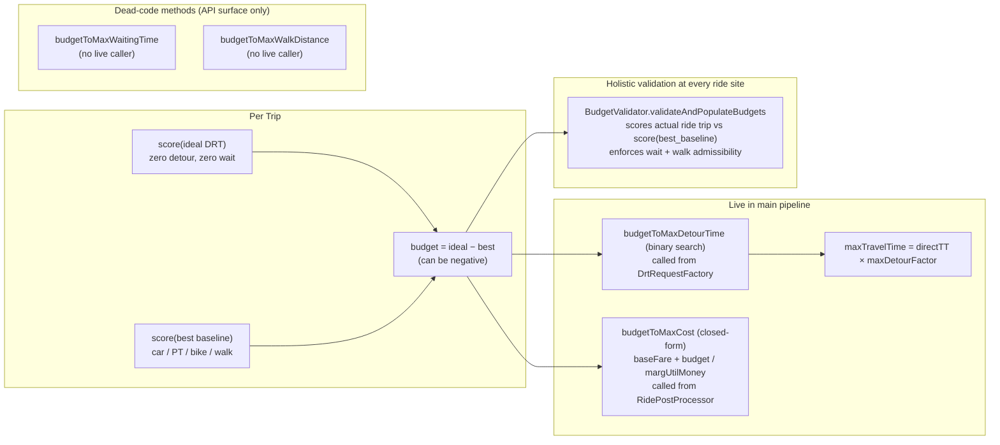

**Binary-search tolerances**: 5.0 (seconds for time, meters for distance) since 2026-03-26 (was 1.0). **Adapter SPI** (`scoring/DemandExtractionScoringAdapter`): three implementations — eqasim, DMC, stock MATSim. Income enters indirectly via subpopulation-specific scoring parameters; per-trip via eqasim's `marginalUtilityOfMoney(d) = |betaCost| × (d/d_ref)^lambda`. Boolean `includeOpportunityCost` was replaced by an `OpportunityCostModel` enum (NONE / LINEAR / LOG); the older `supportsIterativeConstraints()` SPI method was replaced by `supportsDistanceSpecificMoneyUtility()`.

## 3. Degree-by-Degree Extension Loop (BAMAS)

The core loop generates rides at increasing pooling degrees via `BamasEngine.run`. Each degree builds on the previous degree's rides and the DegreeGraph extension index.

```mermaid
flowchart TD
    D2[Degree 2 rides<br/>FIFO + LIFO pairs]
    
    subgraph "Degree k → k+1 Extension (BamasRideExtender)"
        FIND[Find candidate sets<br/>DegreeGraph.findExtensions at k≥4<br/>ShareabilityGraph.findCommonNeighbors at k=3]
        DEDUP["Atomic ConcurrentHashMap dedup<br/>claimedHashes.add(setHash) at line 206"]
        PROC[processSet per candidate<br/>parallel ForkJoinPool]
        EVAL[OrderingEnumerator.enumerateAndEvaluateSeeded<br/>DFS + B&B + 6 admissibility checks]
        BEST1["Keep min-distance valid ordering<br/>resultBySetHash at line 145<br/>tighten on VALID orderings only"]
    end

    subgraph "Between Degrees"
        PRUNE[PostExtensionPruner — optional<br/>COVERAGE_TOPK or RATIO_THRESHOLD<br/>degree-2 rides never pruned]
        BUILD_DG[DegreeGraph.buildFromRides<br/>indexes (k-1)-subsets → extension elements]
    end

    subgraph "Termination"
        TERM[zero new rides at degree d<br/>OR maxPoolingDegree cap]
    end

    D2 --> FIND --> DEDUP --> PROC --> EVAL --> BEST1
    BEST1 --> PRUNE --> BUILD_DG
    BUILD_DG -->|next iteration| FIND
    BEST1 -.->|no new rides| TERM
```

**Saturation termination**: when no new rides are produced at degree d, the loop exits. On Lyon 10% R2 reaches saturation at d = 14 (32M rides retained). **Final batch validation**: `BudgetValidator.populateBudgetsBatch` runs once at `BamasEngine.java:187`, gated by `exmas.deferExtensionBudgetValidation` (default false). The 2026-04-26 in-place mutation pattern (`Ride.setRemainingBudgets` setter + compact-in-place batch) reduced peak ride retention from 2× to 1× input — load-bearing for 32M-ride scale.

**R1 reference path** has no extension loop and no DegreeGraph — `ReferenceRideExtender.cartesianProduct` enumerates every combination of FIFO/LIFO pair-rides per set and retains every admissible ordering. This is the design that lets R1 be a faithful Algorithm-2 reference port; it is also why R1 OOMs at d = 5 on Lyon 10% even at 100 GB heap.

## 4. Pairwise Constraint Extraction

For each candidate set, pairwise constraints from degree-2 rides determine
which orderings are topologically valid.

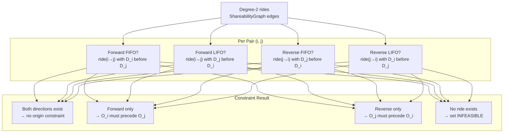

**Routing-cache fix (2026-04-25).** `PairGenerator.generatePairs` computes the SSSP envelope `globalMaxTravelTime = max(r.maxTravelTime)` once per call (lines 90–95), with an inline correctness argument at lines 195–199 (the cache key `(origin, dest, timeBin)` is anonymous, so a per-request bound contaminates entries shared across requests with the same origin link). The beeline pre-filter remains active (lines 228–246) with `BeelineDetourFilterTest` codifying zero false rejections.

**Note: no consensus tightening.** Older versions of this document described a `DegreeGraph.getOriginConsensus` call that tightens BOTH-ways pairs to one direction at degree ≥ 4 (`enableConsensusTightening` flag). **That mechanism does not exist in the current code.** The DegreeGraph is a pure extension-index structure; it does not modify pairwise constraints.

## 5. Set Evaluation Decision Tree

This is the core per-set evaluation in `BamasRideExtender.processSet` showing every check, constraint, and pruning mechanism in the order they are applied. The OrderingEnumerator implements **six admissibility-preserving mechanisms** plus a **parent-seeded sort bias** that tightens `bestValidDist[0]` early.

```mermaid
flowchart TD
    START([BamasRideExtender.processSet<br/>candidate set S, degree D])
    
    SAME_PAX{Same person<br/>in two requests?}
    START --> SAME_PAX
    SAME_PAX -->|yes| REJECT_PAX([Reject: same-person])
    
    EXTRACT[Extract PairInfo bits<br/>from ShareabilityGraph]
    SAME_PAX -->|no| EXTRACT
    
    ANY_MISSING{Any pair has<br/>no shared ride?}
    EXTRACT --> ANY_MISSING
    ANY_MISSING -->|yes| REJECT_PAIR([Reject: missing pair])
    
    ENUM[Build origin DAG<br/>from PairInfo + parent seed]
    ANY_MISSING -->|no| ENUM
    ENUM --> ORIGIN_ENUM

    subgraph ORIGIN_ENUM ["Origin Enumeration (recursive, depth 0→D)"]
        direction TB
        DEPTH_CHECK{depth == D?<br/>all origins placed}
        
        CHECK_A_O{"#1 Check A — origin:<br/>any placed passenger's<br/>origin-only travel time<br/>> maxTravelTime?"}
        
        MININ_GUARD{"depth > 0?<br/>(asymmetric guard:<br/>first-placed origin<br/>has no incoming segment)"}
        
        MININ_LB{"#4 minIn LB cut:<br/>partialDist + totalMinInRemaining<br/>> bestValidDist[0]?"}
        
        TOPO_FILTER["Topological filter:<br/>candidates whose DAG<br/>predecessors are placed"]
        
        SORT_GREEDY["Parent-seeded sort:<br/>primary = parent-consistent rank<br/>secondary = cheapest segment dist"]
        
        ROUTE_ORIGIN[Route segment via cache:<br/>prev origin → candidate origin]
        
        DIST_BB{"#3 Distance B&B per-segment:<br/>partialDist + segment<br/>> bestValidDist[0]?"}
        
        DELAY_O{"#5 Delay-window check (origin):<br/>per-passenger delay<br/>over-approx > budget?"}
        
        RECURSE[Recurse: depth + 1<br/>with candidate placed]
    end
    
    ORIGIN_ENUM --> DEPTH_CHECK
    DEPTH_CHECK -->|no| CHECK_A_O
    CHECK_A_O -->|violated| PRUNE_A([prunedByTravelTime++<br/>prune subtree])
    CHECK_A_O -->|ok| MININ_GUARD
    MININ_GUARD -->|depth=0| TOPO_FILTER
    MININ_GUARD -->|depth>0| MININ_LB
    MININ_LB -->|exceeded| PRUNE_LB([prune: LB cut])
    MININ_LB -->|within bound| TOPO_FILTER
    TOPO_FILTER --> SORT_GREEDY --> ROUTE_ORIGIN --> DIST_BB
    DIST_BB -->|exceeded| BREAK_BB([Break: distance B&B<br/>prunes all remaining sorted candidates])
    DIST_BB -->|within bound| DELAY_O
    DELAY_O -->|over| PRUNE_DEL_O([prunedByDelayWindowOrigin++])
    DELAY_O -->|ok| RECURSE
    RECURSE --> DEPTH_CHECK
    
    DEPTH_CHECK -->|yes: all origins placed| DEST_ENUM

    subgraph DEST_ENUM ["Destination Enumeration (recursive, depth 0→D)"]
        direction TB
        DEST_STRUCT{"#6 Structural infeasibility?<br/>no pair-ride in chosen direction<br/>completes the topo sort"}
        
        DEST_DEPTH{depth == D?<br/>all dests placed}
        
        DEST_CHECK_A{"#2 Check A — dest:<br/>any undropped passenger's<br/>origin-only TT > maxTravelTime?"}
        
        DEST_MININ{"#4 minIn LB (all-depths on dest):<br/>partialDist + totalMinInRemaining<br/>> bestValidDist[0]?"}
        
        DEST_TOPO[Topological filter:<br/>destination DAG<br/>from FIFO/LIFO + origin order]
        
        DEST_ROUTE[Route segment via cache:<br/>prev stop → candidate dest]
        
        DEST_DIST_BB{"#3 Distance B&B per-segment"}
        
        DROPOFF_CHECK{"Dropoff check:<br/>passenger full in-vehicle<br/>at their dropoff > maxTT?"}
        
        DEST_CHECK_B{"Check B:<br/>any remaining on-vehicle pax<br/>would exceed maxTT?"}
        
        DELAY_D{"#5 Delay-window check (dropoff):<br/>per-passenger delay (exact)<br/>> budget?"}
        
        DEST_RECURSE[Recurse: dest depth + 1]
    end
    
    DEST_ENUM --> DEST_STRUCT
    DEST_STRUCT -->|infeasible| REJECT_STRUCT([Return: structural<br/>infeasibility])
    DEST_STRUCT -->|ok| DEST_DEPTH_START
    DEST_DEPTH_START([Start dest enumeration]) --> DEST_DEPTH
    DEST_DEPTH -->|no| DEST_CHECK_A
    DEST_CHECK_A -->|violated| PRUNE_DA([prunedByTravelTime++<br/>prune subtree])
    DEST_CHECK_A -->|ok| DEST_MININ
    DEST_MININ -->|exceeded| PRUNE_DMI([prune: LB cut])
    DEST_MININ -->|within bound| DEST_TOPO
    DEST_TOPO --> DEST_ROUTE --> DEST_DIST_BB
    DEST_DIST_BB -->|exceeded| BREAK_DEST_BB([Break: distance B&B])
    DEST_DIST_BB -->|within bound| DROPOFF_CHECK
    DROPOFF_CHECK -->|exceeded| SKIP_DROP([prunedByTravelTime++<br/>skip candidate])
    DROPOFF_CHECK -->|ok| DEST_CHECK_B
    DEST_CHECK_B -->|violated| SKIP_B([prunedByTravelTime++])
    DEST_CHECK_B -->|ok| DELAY_D
    DELAY_D -->|over| PRUNE_DEL_D([prunedByDelayWindowDropoff++])
    DELAY_D -->|ok| DEST_RECURSE
    DEST_RECURSE --> DEST_DEPTH
    
    DEST_DEPTH -->|yes: complete ordering| EVALUATOR

    subgraph EVALUATOR ["evaluateOrdering callback (~line 453)"]
        direction TB
        BUILD_RIDE[buildRideFromOrdering<br/>pre-routed segments → Ride]
        
        DELAY_OPT{Delay optimization<br/>feasible?}
        
        BUDGET_VAL["BudgetValidator.validateAndPopulateBudgets<br/>score actual DRT trip vs score(best_baseline)<br/>uses ScoringContext cache"]
        
        BUDGET_OK{All passengers<br/>remainingBudget ≥ 0?}
        
        TIGHTEN_BOUND["bestValidDist[0] ← ride.distance<br/>(tighten on VALID orderings only)"]
    end
    
    EVALUATOR --> BUILD_RIDE --> DELAY_OPT
    DELAY_OPT -->|infeasible| REJECT_DELAY([Reject: delay bounds])
    DELAY_OPT -->|feasible| BUDGET_VAL --> BUDGET_OK
    BUDGET_OK -->|no| REJECT_BUDGET([Reject: budget violation])
    BUDGET_OK -->|yes| TIGHTEN_BOUND
    TIGHTEN_BOUND --> VALID_RIDE([Valid ride: update bestRide<br/>if shorter than current best])
```

**Bound-tightening discipline.** `bestValidDist[0]` is updated **only** when a complete admissible ordering finishes — never on infeasible partials. This is enforced together with the parent-seeded sort: the parent's ordering (or its parent-consistent extension when a new request is inserted) is explored first, finding a valid ride and a useful bound early. Per `bnb-tightening-v1` numbers, ≥ 83% of valid rides at degrees 4–11 are reached via the parent-seeded ordering. Catches: `UnsoundBreakRegressionTest`, `MinInLowerBoundTest`, `ParentConsistentSortTest`.

**No cross-degree learning structures.** Older versions of this document described `OrderingConflicts` (cross-degree conflict learning) and `SubSetOrderingFeasibility` (Lehmer-encoded sub-set ordering lookup) sitting between origin Check A and the routing step. **These mechanisms have been removed from the source tree.** The `minIn` LB cut + parent-seeded DFS sort provides equivalent pruning power without the bookkeeping cost; the routing cache makes per-segment lookups effectively free, eliminating the motivation for amortizing routing across orderings via combinatorial sub-set feasibility.

## 6. Cross-Degree Data Flow (BAMAS)

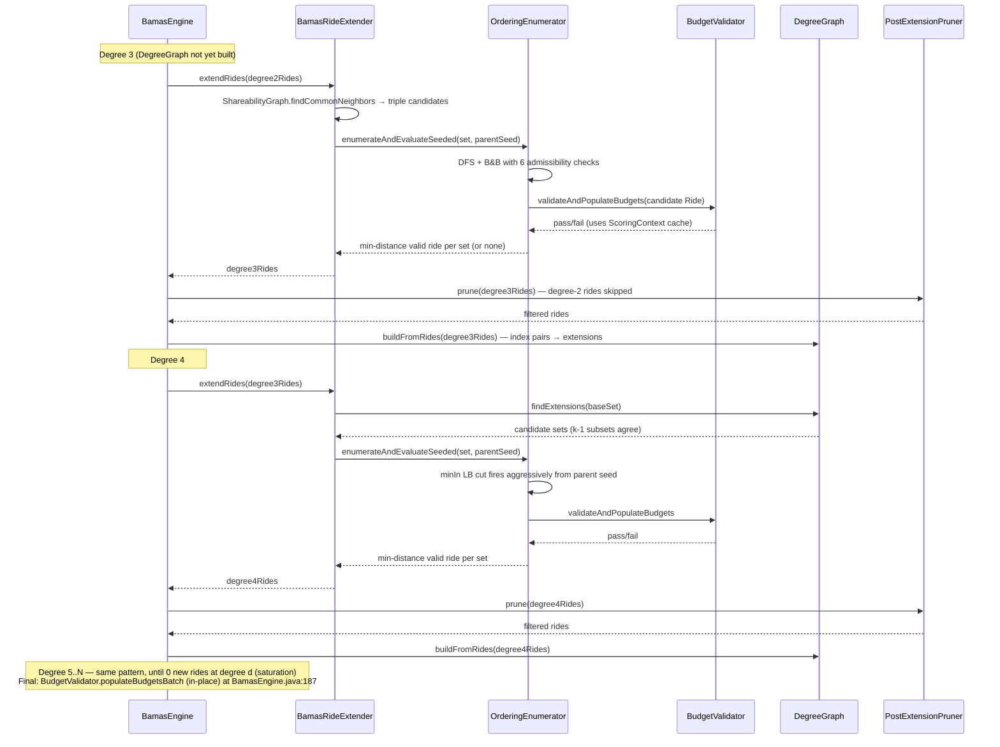

**Per-degree data structures**:
- `EnumerationStats` — orderings evaluated, parentSeedRidesFound, prunedByTravelTime, prunedByDelayWindow*, prunedByDistanceBB
- `MemoryProfiler` — end-of-degree heap snapshots; before/after `populateBudgetsBatch`; engine completion. Source of paper §5 memory column.

**No cross-degree conflict learning.** Older versions of this document showed `OrderingConflicts` and `SubSetOrderingFeasibility` participants in the sequence diagram with `commit()` calls between degrees and `hasConflict?` / `isInfeasible?` lookups during enumeration. **Those participants have been removed.** The current cross-degree information flow is just (a) the `DegreeGraph` extension index and (b) the parent-seeded DFS sort that propagates the parent's ordering to children. There is no bitmap-based learning between degrees.

## 7. Pruning Mechanisms Summary

All pruning mechanisms ordered by when they apply during set evaluation. The six admissibility-preserving mechanisms (P5/P10 = Check A on both phases; P6 = minIn LB cut; P8/P11 = distance B&B; P9 = structural infeasibility; P12 = delay-window) are the methodological core. P4 is the DAG topological filter (information reuse, also admissibility-preserving). P3 is part of the DegreeGraph extension index (cross-degree information reuse). P15 (in-DFS shared-ride-efficiency gate) and P19 (post-extension pruner) are the two **optional planner-tunable** filters that are NOT admissibility-preserving.

```mermaid
flowchart TD
    subgraph "Pre-Enumeration"
        P1["Same-person filter<br/>O(D^2) per set"]
        P2["Missing-pair filter<br/>O(D^2) constraint extraction"]
        P3["DegreeGraph extension index<br/>(k-1)-subset agreement filter"]
    end

    subgraph "Origin Phase"
        P4["Topological filter<br/>DAG adjacency"]
        P5["#1 Check A — origin<br/>per-passenger TT vs maxTravelTime"]
        P6["#4 minIn LB cut<br/>partialDist + totalMinInRemaining"]
        P7["Parent-seeded sort<br/>tightens bound early — not a prune"]
        P8["#3 Distance B&B per-segment<br/>sorted candidates, break on exceed"]
    end

    subgraph "Destination Phase"
        P9["#6 Structural infeasibility<br/>no pair ride in chosen direction"]
        P10["#2 Check A — dest<br/>any undropped pax TT > maxTT"]
        P11["#3 Distance B&B per-segment"]
        P12["#5 Delay-window<br/>over-approx origin + exact dropoff"]
        P13["Dropoff check<br/>passenger full TT at their dropoff"]
        P14["Check B<br/>remaining on-vehicle pax"]
    end

    subgraph "Evaluation Phase"
        P15["In-DFS shared-ride-efficiency gate<br/>OPTIONAL (pruningDistanceSavingsLogScale)"]
        P16["Delay optimization feasibility"]
        P17["BudgetValidator<br/>holistic per-passenger validation"]
        P18["Bound tightening on VALID only<br/>bestValidDist[0] ← ride.distance"]
    end

    subgraph "Post-Extension"
        P19["PostExtensionPruner — OPTIONAL<br/>COVERAGE_TOPK K=20 (production)<br/>degree ≥ 3 only"]
    end

    P1 --> P2 --> P3
    P3 --> P4 --> P5 --> P6 --> P7 --> P8
    P8 --> P9 --> P10 --> P11 --> P12 --> P13 --> P14
    P14 --> P15 --> P16 --> P17 --> P18
    P18 --> P19
```

P15 evaluates the same quantity used in Paper 1 under the reader-facing
name **shared-ride efficiency**:

`eta = 1 - rideDistance / sum(directDistance_i)`

The gate keeps a candidate of degree `d` only if
`eta >= min(maxSaving, scale * log2(d))`. Older notes in this repo call
the same quantity "distance savings"; the semantics are identical. The
intent is to cut the large tail of rides that are poolable but save
little vehicle-kilometre, while tightening the minimum acceptable
efficiency with degree until capped.

P19 solves a different problem. After a ride survives P15 and holistic
validation, `COVERAGE_TOPK` preserves per-request variety within each
degree by keeping rides in descending savings order until every request
still has enough options. Production R4 uses `COVERAGE_TOPK(K=20,
ABS_SAVINGS)` on top of the P15 gate.

### Pruning effectiveness (historical 10% Bavaria, 21k requests)

> Lyon 10% per-degree counter data lives in the comparison-battery `EnumerationStats` artifacts (commit `0e811ed`). The Bavaria numbers below predate the algorithm/{exmas,bamas} fork and are kept for relative-magnitude reference only.

| Mechanism | Degree 5 | Degree 6 | Degree 7 |
|:---|:---:|:---:|:---:|
| DegreeGraph extension index | 82% candidate reduction at d=4, 93.5% at d=5 | strong | strong |
| Check A (origin + dest) | 1.7× speedup | 1.7× | 1.7× |
| Distance B&B per-segment | dominant deg 3–4 | moderate | minor |
| minIn LB cut | growing | dominant | dominant (billions of fires at d 8–9) |
| Parent-seeded sort | ≥ 83% of valid rides reached via parent seed at d 4–11 | same | same |
| Dropoff check | 93.5% of dest failures | 93.5% | 93.5% |

## 8. Pipeline Timing (historical 10% Bavaria, degrees 3–7)

> The current production scenario is Lyon 10% (eqasim-france Loyette cluster, ~30k DRT requests). Lyon-specific timing is captured in the comparison-battery artifacts and the synthesis at `papers/paper1/planning/reviews/2026-04-27-bamas-deep-dive-synthesis.md`. The Bavaria numbers below predate the algorithm/{exmas,bamas} fork; they show the order-of-magnitude scaling but are not the production figures.

```mermaid
gantt
    title Execution Time by Degree (10% Bavaria — historical)
    dateFormat X
    axisFormat %s s

    section Degree 3
    Enumeration + validation :0, 23
    
    section Degree 4
    Enumeration + validation :0, 10
    
    section Degree 5
    Enumeration + validation :0, 31

    section Degree 6
    Enumeration + validation :0, 124

    section Degree 7
    Enumeration + validation :0, 405
```

The factorial wall on orderings per set dominates at high degrees:

| Degree | Avg orderings/set | Typical candidates | Wall-clock time (Bavaria 10%) |
|:---:|:---:|:---:|:---:|
| 3 | 2-6 | ~473k sets | 23s |
| 4 | 3-18 | ~180k sets | 10s |
| 5 | 4-40 | ~95k sets | 31s |
| 6 | 15-200 | ~45k sets | 124s |
| 7 | 100-9000 | ~18k sets | 405s |

**Lyon 10% headline numbers (R1/R2/R4 paper naming, R3 row pending)**: R1 OOMs at d=5 even at 100 GB heap (the `cartesianProduct` retention blows up); R2 saturates at d=14 in 3h17m with 32M rides retained (no pruning); R4 (production: both pruning gates ON) completes in well under R2's wall time.

## 9. Output Schema

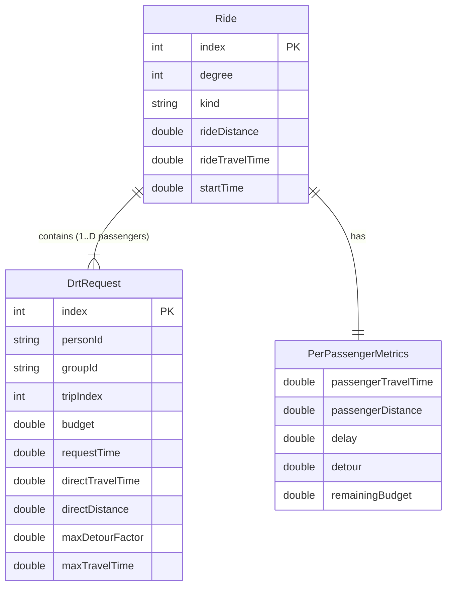

### Output files

| File | Content | Consumer |
|:---|:---|:---|
| `drt_requests.csv` | One row per DRT-eligible trip with budget | ExmasCommuters (Python MIP) |
| `exmas_rides.csv` | One row per feasible shared ride | ExmasCommuters (Python MIP) |
| `person_attributes.csv` | Demographics for clustering | SimWrapper visualization |
| `connection_cache.csv` | Predecessor/successor links | Empty vehicle routing |

## 10. Worked Example: 4 Requests Through Degree 1–4

> **Note on this section.** §10.1–10.4 below (setup, degree 1, degree 2, shareability graph) are unchanged — they describe the still-current pair generation and ShareabilityGraph behavior. §10.5 onwards has been **edited to remove all references to the deleted `SubSetOrderingFeasibility` mechanism**. Where the old example walked through "Trigger 2" recording and degree-4 sub-set lookup hits, the corrected trace shows the equivalent pruning being done by the `minIn` LB cut and per-segment distance B&B. The original tree shapes and per-ordering decisions are preserved; only the bookkeeping mechanism has changed.

This section traces four DRT requests through every phase of the algorithm,
visualizing DAGs, orderings, pruning checks, and cross-degree learning.

### 10.1 Setup: Four Requests Along a Corridor

```
West ──────────────────────────────────────────────────── East

  O_A ───5km──── O_B ───3km──── O_C ───4km──── O_D
  8:00           8:02           8:04           8:05

                    D_B                D_D
                    │ 6km               │ 5km
                    ▼ south             ▼ south
        D_A                 D_C
        │ 8km               │ 9km
        ▼ south             ▼ south
```

| Request | Origin | Dest | Depart | directTT | maxDetourFactor | maxTravelTime |
|:---:|:---:|:---:|:---:|:---:|:---:|:---:|
| **A** | O_A | D_A | 8:00 | 10 min | 1.5 | **15 min** |
| **B** | O_B | D_B | 8:02 | 7 min | 1.6 | **11.2 min** |
| **C** | O_C | D_C | 8:04 | 11 min | 1.5 | **16.5 min** |
| **D** | O_D | D_D | 8:05 | 6 min | 1.8 | **10.8 min** |

### 10.2 Degree 1: Single Rides

Each request gets a direct (unshared) ride. Budget validation computes
`remainingBudget = score(DRT direct) − score(best baseline mode)`.

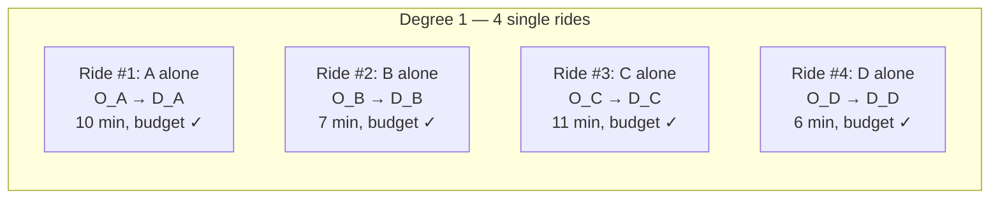

**Output:** 4 single rides, all pass budget validation.

### 10.3 Degree 2: Pair Generation

The PairGenerator tries every pair in both directions (A first vs B first)
and both kinds (FIFO = first-in-first-out, LIFO = last-in-first-out).

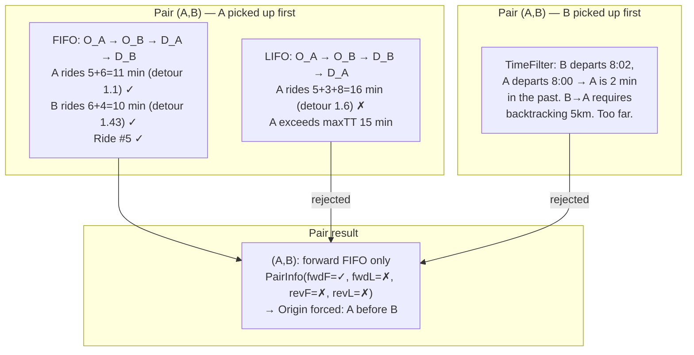

All six pairs are evaluated. Here are the results:

| Pair | A→B FIFO | A→B LIFO | B→A FIFO | B→A LIFO | PairInfo | Origin constraint |
|:---:|:---:|:---:|:---:|:---:|:---:|:---:|
| **(A,B)** | ✓ | ✗ | ✗ | ✗ | (T,F,F,F) | **A before B** |
| **(A,C)** | ✓ | ✗ | ✓ | ✗ | (T,F,T,F) | none |
| **(A,D)** | ✓ | ✗ | ✓ | ✗ | (T,F,T,F) | none |
| **(B,C)** | ✓ | ✗ | ✗ | ✗ | (T,F,F,F) | **B before C** |
| **(B,D)** | ✓ | ✓ | ✓ | ✗ | (T,T,T,F) | none |
| **(C,D)** | ✓ | ✗ | ✓ | ✗ | (T,F,T,F) | none |

**Output:** 10 pair rides (some pairs produce rides in both directions), all pass budget.

### 10.4 Shareability Graph

The shareability graph stores which pairs are feasible and with what kind.
Edges are directional: edge (A→B, FIFO) means "ride with A first, FIFO dropoff."

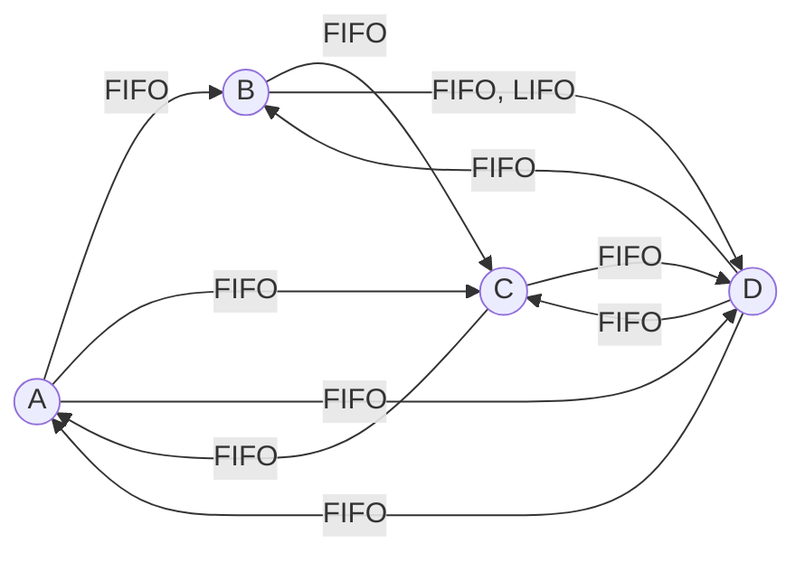

Key observations:
- **A→B exists but B→A does not** → A must always be picked up before B
- **B→C exists but C→B does not** → B must always be picked up before C
- **All other pairs** have edges in both directions → no forced origin order

### 10.5 Degree 3: Triple Enumeration

#### 10.5.1 Candidate generation

At degree 3, candidates are found via `ShareabilityGraph.findCommonNeighbors`.
A triple {X,Y,Z} is a candidate if all three pairs (X,Y), (X,Z), (Y,Z) have
at least one shared ride.

All 4 triples are feasible: **{A,B,C}**, **{A,B,D}**, **{A,C,D}**, **{B,C,D}**

#### 10.5.2 Triple {A, B, C} — Constrained DAG

**Step 1: Build origin DAG from pairwise constraints**

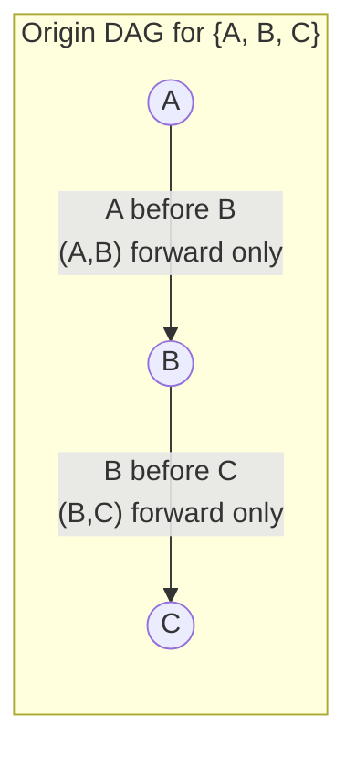

The DAG forces a single topological sort: **A → B → C**. Only 1 origin ordering.

**Step 2: Build destination DAG for origin [A, B, C]**

For each pair, the destination constraint depends on the chosen origin direction:

| Pair | Origin order | Direction | Available kinds | Dest constraint |
|:---:|:---:|:---:|:---:|:---:|
| (A,B) | A before B | forward | FIFO only | **D_A before D_B** |
| (A,C) | A before C | forward | FIFO only | **D_A before D_C** |
| (B,C) | B before C | forward | FIFO only | **D_B before D_C** |

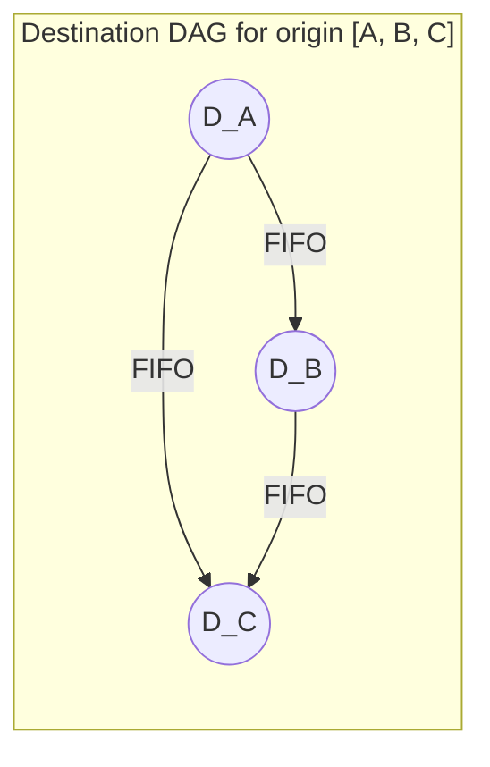

Only 1 valid destination ordering: **D_A → D_B → D_C**

**Step 3: Evaluate the single complete ordering**

```
Route: O_A → O_B → O_C → D_A → D_B → D_C
         5min   3min   7min   3min   4min
```

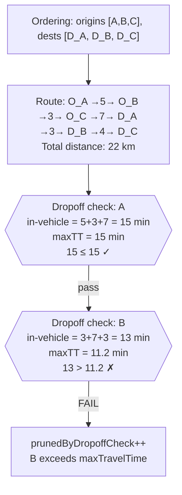

**Result:** {A,B,C} produces **0 valid rides**. Because no valid ride is found, this triple is **not** added to the DegreeGraph extension index — no degree-4 candidate set containing {A,B,C} as a 3-subset will be generated. (In older versions of this document, the same outcome was additionally recorded as a Lehmer-encoded sub-set ordering infeasibility for cross-degree lookup; that bookkeeping has been removed.)

#### 10.5.3 Triple {A, C, D} — Unconstrained DAG, Multiple Orderings

**Step 1: Origin DAG** — All three pairs allow both directions → empty DAG.

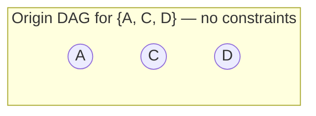

All 3! = **6 origin orderings** are topologically valid:
`[A,C,D]  [A,D,C]  [C,A,D]  [C,D,A]  [D,A,C]  [D,C,A]`

**Step 2: Branch-and-bound tree for origin enumeration**

The origin enumeration is a depth-first search tree. At each depth, candidates
are sorted by routed distance from the previous origin. The accumulated
`partialDist` is tracked. When it exceeds `bestValidDist`, all remaining
(sorted) candidates at that depth are pruned via `break`.

The bound `bestValidDist` starts at the maximum allowed ride distance (∞) and
**tightens only when a fully valid ride is found** (passes all checks + budget).

Segment distances for this example:

| From → To | Distance | Travel time |
|:---|:---:|:---:|
| O_A → O_C | 8 km | 10 min |
| O_A → O_D | 12 km | 15 min |
| O_C → O_A | 8 km | 10 min |
| O_C → O_D | 4 km | 5 min |
| O_D → O_A | 12 km | 15 min |
| O_D → O_C | 4 km | 5 min |

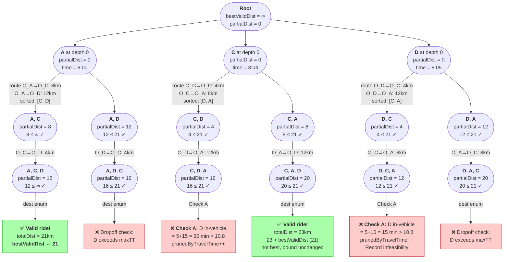

**Reading the tree:**
- Each node shows the origin ordering built so far, the accumulated `partialDist`,
  and whether it passes the distance bound check.
- Green leaves (✅) are orderings that produced valid rides.
- Red leaves (❌) show the specific check that pruned the ordering.
- At depth 1, candidates are **sorted by segment distance** — cheaper candidates
  are explored first, finding good bounds early.
- The bound tightens to **21 km** after the first valid ride [A,C,D].
  All subsequent branches with `partialDist > 21` would be pruned by `break`.
  In this example, no branch actually exceeds 21 in the origin phase — the
  bound's full power shows at degree 4+ where origin distances grow.

**Key property:** Because candidates are sorted by distance at each depth
and the bound only decreases, the `break` statement prunes not just the
current candidate but **all remaining candidates** at that depth (they are
guaranteed to have equal or larger distance). This is what makes it a
proper branch-and-bound, not just branch-and-check.

**Step 3: Check A during origin enumeration**

Two orderings are pruned by Check A before destination enumeration starts.
This is an **absolute** constraint (maxTravelTime is fixed per passenger),
unlike the distance B&B which uses a **relative** bound.

Detailed trace for ordering [D, C, A]:

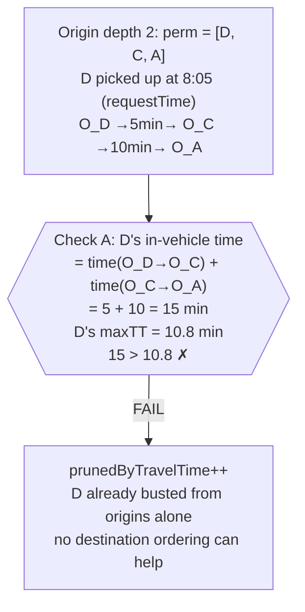

**Step 4: Summary of all 6 orderings for {A,C,D}**

| # | Origin ordering | partialDist | Dest result | Status |
|:---:|:---|:---:|:---|:---|
| 1 | A, C, D | 12 km | dest [D_A, D_C, D_D] ✓ | **Valid ride, totalDist = 21km. Bound tightens.** |
| 2 | A, D, C | 16 km | D fails dropoff check | ❌ Dropoff |
| 3 | C, D, A | 16 km | — | ❌ Check A: D at 20 min > 10.8 |
| 4 | C, A, D | 20 km | dest [D_C, D_A, D_D] ✓ | **Valid ride, totalDist = 23km** (not best) |
| 5 | D, C, A | 12 km | — | ❌ Check A: D at 15 min > 10.8 |
| 6 | D, A, C | 20 km | D fails dropoff check | ❌ Dropoff |

The B&B tree explored all 6 origin orderings (none exceeded the 21km bound
in the origin phase alone). The pruning came from Check A (absolute travel
time) and the dropoff check (during destination enumeration).

At higher degrees, the distance B&B becomes dominant: with 5+ origins,
the partial distance from a bad first-origin choice quickly exceeds the
bound, pruning entire subtrees before any routing of later origins.

**Best ride for {A,C,D}:** ordering #1, distance 21km.

#### 10.5.4 Degree-3 results summary

| Triple | Origin orderings | Evaluated | Valid rides | Best dist |
|:---:|:---:|:---:|:---:|:---:|
| {A,B,C} | 1 | 1 | 0 | — |
| {A,B,D} | 2 | 3 | 1 | 19km |
| {A,C,D} | 6 | 4 | 2 | 21km |
| {B,C,D} | 3 | 5 | 2 | 18km |

### 10.6 DegreeGraph After Degree 3

The DegreeGraph is built from valid degree-3 rides. It has two components:

#### Extension Index

Maps each pair (2-subset) to the list of requests that extend it to a valid triple:

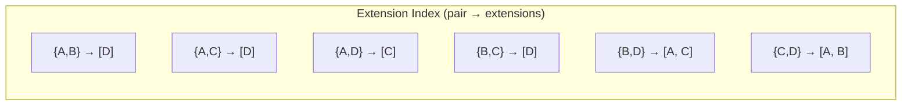

Note: {A,B,C} had 0 valid rides → **not** in the extension index.
This means no degree-4 set containing {A,B,C} as a sub-set will be
generated as a candidate.

The DegreeGraph stores **only** the extension index (pair → list of valid extension elements). Older versions of this document described an additional consensus-bitmask component used for optional pairwise tightening (`enableConsensusTightening` flag); that mechanism does not exist in the current code.

### 10.7 Degree 4: Set {A, B, C, D}

For this section, assume {A,B,C} produced 1 valid ride at degree 3 (with
ordering [A,B,C], dest [D_B,D_A,D_C]), so {A,B,C,D} passes the DegreeGraph
filter as a valid degree-4 candidate. This lets us trace the full enumeration.

**Segment distances and travel times (origin-to-origin):**

| Segment | Distance | Travel time |
|:---|:---:|:---:|
| O_A → O_B | 5 km | 6 min |
| O_A → O_D | 12 km | 15 min |
| O_B → O_C | 3 km | 4 min |
| O_B → O_D | 7 km | 9 min |
| O_C → O_D | 4 km | 5 min |
| O_D → O_A | 12 km | 15 min |
| O_D → O_B | 7 km | 9 min |
| O_D → O_C | 4 km | 5 min |

#### 10.7.1 All 24 permutations vs. DAG constraints

The pairwise constraints yield origin DAG edges **A→B** and **B→C**. Of the
4! = 24 possible origin permutations, only those respecting both edges are
topologically valid.

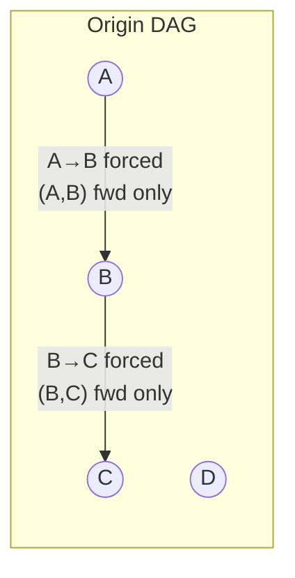

D has **no forced edges** — it can appear at any position as long as A < B < C
is maintained.

| # | Permutation | A < B? | B < C? | Valid? |
|:---:|:---|:---:|:---:|:---:|
| 1 | **A, B, C, D** | ✓ | ✓ | **✓** |
| 2 | **A, B, D, C** | ✓ | ✓ | **✓** |
| 3 | A, C, B, D | ✓ | ✗ | ✗ |
| 4 | A, C, D, B | ✓ | ✗ | ✗ |
| 5 | **A, D, B, C** | ✓ | ✓ | **✓** |
| 6 | A, D, C, B | ✓ | ✗ | ✗ |
| 7 | B, A, C, D | ✗ | — | ✗ |
| 8 | B, A, D, C | ✗ | — | ✗ |
| 9 | B, C, A, D | ✗ | — | ✗ |
| 10 | B, C, D, A | ✗ | — | ✗ |
| 11 | B, D, A, C | ✗ | — | ✗ |
| 12 | B, D, C, A | ✗ | — | ✗ |
| 13 | C, A, B, D | — | ✗ | ✗ |
| 14 | C, A, D, B | — | ✗ | ✗ |
| 15 | C, B, A, D | ✗ | ✗ | ✗ |
| 16 | C, B, D, A | ✗ | ✗ | ✗ |
| 17 | C, D, A, B | — | ✗ | ✗ |
| 18 | C, D, B, A | ✗ | ✗ | ✗ |
| 19 | **D, A, B, C** | ✓ | ✓ | **✓** |
| 20 | D, A, C, B | ✓ | ✗ | ✗ |
| 21 | D, B, A, C | ✗ | — | ✗ |
| 22 | D, B, C, A | ✗ | — | ✗ |
| 23 | D, C, A, B | — | ✗ | ✗ |
| 24 | D, C, B, A | ✗ | ✗ | ✗ |

**20 of 24 permutations eliminated by the DAG** before any routing.
4 survivors: **[A,B,C,D]**, **[A,B,D,C]**, **[A,D,B,C]**, **[D,A,B,C]**.

The topological sort builds these lazily — it never generates the 20 invalid
permutations. At each recursive depth, only candidates whose DAG predecessors
are all placed are considered.

#### 10.7.2 Branch-and-bound tree with in-vehicle times

The tree below traces every node the algorithm visits. At each node:
- **Bold** = the passenger just picked up
- In-vehicle times shown for all passengers currently in the vehicle
- `partialDist` = accumulated origin-to-origin distance so far
- `bestValidDist` starts at maxRideDistance (29 km) and tightens when valid rides are found

```mermaid
flowchart TD
    ROOT(["<b>Root</b><br/>bestValidDist = 29 km<br/>partialDist = 0"])

    %% ========================
    %% Depth 0: candidates with no DAG predecessors: A and D
    %% No routing at depth 0, no sorting. Iterated in index order.
    %% ========================

    ROOT -->|"depth 0<br/>DAG allows: A, D"| A0

    A0(["Pick <b>A</b><br/>time = 8:00<br/>In-vehicle: A=0 min<br/>partialDist = 0"])

    %% ========================
    %% Branch A: depth 1
    %% Candidates: B (pred A placed ✓), D (no preds ✓). C needs B (✗).
    %% Route from O_A: O_A→O_B=5km/6min, O_A→O_D=12km/15min
    %% Sorted by distance: [B(5km), D(12km)]
    %% ========================

    A0 -->|"depth 1: candidates [B, D]<br/>sorted: B=5km, D=12km"| AB1

    AB1(["Pick <b>B</b><br/>O_A →5km/6min→ O_B<br/>time = 8:06<br/>In-vehicle: A=6min, B=0<br/>partialDist = 5"])

    %% ========================
    %% Branch A,B: depth 2
    %% Check A: A=6min ≤ 15 ✓, B=0 ✓
    %% Candidates: C (pred B placed ✓), D (no preds ✓)
    %% Route from O_B: O_B→O_C=3km/4min, O_B→O_D=7km/9min
    %% Sorted: [C(3km), D(7km)]
    %% ========================

    AB1 -->|"depth 2: [C, D] sorted<br/>Check A: A=6 ≤ 15 ✓"| ABC2

    ABC2(["Pick <b>C</b><br/>O_B →3km/4min→ O_C<br/>time = 8:10<br/>In-vehicle: A=10, B=4, C=0<br/>partialDist = 8"])

    %% ========================
    %% Branch A,B,C: depth 3
    %% Check A: A=10 ≤ 15 ✓, B=4 ≤ 11.2 ✓, C=0 ✓
    %% Only candidate: D
    %% Route O_C→O_D=4km/5min. partialDist = 12
    %% Sub-set lookup: {A,B,D}→ok, {A,C,D}→ok, {B,C,D}→ok
    %% ========================

    ABC2 -->|"depth 3: [D]<br/>Check A: A=10, B=4 ✓"| ABCD3

    ABCD3(["Pick <b>D</b><br/>O_C →4km/5min→ O_D<br/>time = 8:15<br/>In-vehicle: A=15, B=9, C=5, D=0<br/>partialDist = 12<br/>12 ≤ 29 ✓"])

    ABCD3 -->|"all origins placed<br/>→ dest enumeration"| ABCD_DEST

    ABCD_DEST["✅ <b>Valid ride!</b><br/>totalDist = 18 km<br/><b>bestValidDist ← 18</b>"]

    %% ========================
    %% Back to A,B: try D next (sorted second)
    %% ========================

    AB1 -->|"next candidate"| ABD2

    ABD2(["Pick <b>D</b><br/>O_B →7km/9min→ O_D<br/>time = 8:15<br/>In-vehicle: A=15, B=9, D=0<br/>partialDist = 12"])

    %% ========================
    %% Branch A,B,D: depth 3
    %% Check A: A=15 ≤ 15 ✓ (barely!), B=9 ≤ 11.2 ✓
    %% Only candidate: C
    %% Route O_D→O_C=4km/5min. partialDist = 16. 16 ≤ 18 ✓
    %% Sub-set lookup: {A,B,C} ordering (A,B,C) → bit 0 SET → INFEASIBLE!
    %% ========================

    ABD2 -->|"depth 3: [C]<br/>Check A: A=15 ≤ 15 ✓"| ABDC3

    ABDC3(["Pick <b>C</b><br/>O_D →4km/5min→ O_C<br/>time = 8:20<br/>In-vehicle: A=20, B=14, D=5, C=0<br/>partialDist = 16<br/>16 ≤ 18 ✓"])

    ABDC3 -->|"all origins placed"| ABDC_DEST

    ABDC_DEST["❌ Dropoff check: D in-vehicle<br/>at D_D = 11.2 min > 10.8 maxTT"]

    %% ========================
    %% Back to A: try D at depth 1 (sorted second, 12km)
    %% ========================

    A0 -->|"next at depth 1"| AD1

    AD1(["Pick <b>D</b><br/>O_A →12km/15min→ O_D<br/>time = 8:15<br/>In-vehicle: A=15, D=0<br/>partialDist = 12"])

    %% ========================
    %% Branch A,D: depth 2
    %% Check A: A=15 ≤ 15 ✓ (barely!), D=0 ✓
    %% Candidates: B (pred A placed ✓). C needs B (✗).
    %% Route O_D→O_B=7km. partialDist = 12+7 = 19.
    %% DISTANCE B&B: 19 > bestValidDist (18) → BREAK!
    %% ========================

    AD1 -->|"depth 2: [B]<br/>Check A: A=15 ≤ 15 ✓"| AD_BB

    AD_BB["Route O_D → O_B: 7 km<br/>partialDist = 12 + 7 = <b>19 km</b><br/>19 > bestValidDist (18)<br/><b>break — distance B&B!</b><br/>Entire subtree [A,D,B,C] pruned"]

    %% ========================
    %% Back to root: try D at depth 0
    %% ========================

    ROOT -->|"depth 0<br/>next candidate"| D0

    D0(["Pick <b>D</b><br/>time = 8:05<br/>In-vehicle: D=0 min<br/>partialDist = 0"])

    %% ========================
    %% Branch D: depth 1
    %% Candidates: A (no preds ✓). B needs A (✗). C needs B (✗).
    %% Route O_D→O_A=12km/15min. Sorted: [A(12km)].
    %% ========================

    D0 -->|"depth 1: [A] only<br/>sorted: A=12km"| DA1

    DA1(["Pick <b>A</b><br/>O_D →12km/15min→ O_A<br/>time = 8:20<br/>In-vehicle: D=15, A=0<br/>partialDist = 12<br/>12 ≤ 18 ✓"])

    %% ========================
    %% Branch D,A: depth 2
    %% Check A: D in-vehicle = 8:20 - 8:05 = 15 min. D maxTT = 10.8. 15 > 10.8 → PRUNE!
    %% ========================

    DA1 -->|"depth 2"| DA_CHECKA

    DA_CHECKA["❌ <b>Check A:</b> D in-vehicle<br/>= 15 min > 10.8 maxTT<br/>prunedByTravelTime++<br/>Entire subtree [D,A,B,C] pruned<br/><br/>Record infeasibility:<br/>perm[0..1] = [D,A] (len 2 < 3, skip)"]

    %% ========================
    %% Styling
    %% ========================
    style ABCD_DEST fill:#afa,stroke:#0a0
    style ABDC_DEST fill:#fcc,stroke:#a00
    style AD_BB fill:#fcc,stroke:#a00,color:#a00
    style DA_CHECKA fill:#fcc,stroke:#a00
```

**Reading the tree:**

| Ordering | Path through tree | Result | Pruned by |
|:---|:---|:---:|:---|
| [A,B,C,D] | Root → A → A,B → A,B,C → A,B,C,D | ✅ **Valid ride, 18km** | — |
| [A,B,D,C] | Root → A → A,B → A,B,D → A,B,D,C | ❌ | Dropoff check (D exceeds maxTT) |
| [A,D,B,C] | Root → A → A,D → **pruned** | ❌ | **Distance B&B** (19 > 18) |
| [D,A,B,C] | Root → D → D,A → **pruned** | ❌ | **Check A** (D at 15 min > 10.8) |

Key observations:

1. **The DAG eliminates 20 of 24 permutations before the tree is even built.**
   The topological filter at each depth only generates candidates whose
   predecessors are placed. B and C never appear at depth 0; C never appears
   before B.

2. **In-vehicle times are tracked for every passenger at every node.** When
   A's in-vehicle time reaches 15 min (its maxTT) at [A,D], one more segment
   would push it over — but the distance B&B catches it first.

3. **The bound tightens from 29 → 18 after the first valid ride.** Because
   candidates are sorted by distance at each depth, the cheapest ordering
   [A,B,C,D] is explored first (partialDist grows as 0→5→8→12). This
   aggressive bound then prunes [A,D,...] whose origin partial (19 km)
   alone exceeds the best total ride (18 km).

4. **Check A prunes [D,A,B,C] at depth 2** without any candidate routing.
   D has been in the vehicle for 15 minutes just traversing O_D→O_A.
   No destination ordering can reduce D's in-vehicle time, so the entire
   subtree is killed immediately.

#### 10.7.3 What the tree would look like without the DAG

Without the origin constraints A→B and B→C, all 24 permutations would be
topologically valid. The tree would have 4 children at depth 0, up to 3 at
depth 1, up to 2 at depth 2, and 1 at depth 3 — potentially visiting 24
leaf nodes. The DAG reduces this to 4 leaves.

At degree 7, the difference is even more dramatic: 7! = 5,040 permutations vs. typically 100–500 after DAG constraints (further reduced by minIn LB cut and parent-seeded sort once the bound tightens).

#### 10.7.4 The minIn LB cut at high degree

Where the sub-set lookup mechanism (now removed) would have flagged candidate C with prefix [A,B,D] by detecting the infeasible (A,B,C) triple ordering, the current code achieves equivalent — or better — pruning via the **minIn LB cut** (mechanism #4 in §5):

- For each unplaced stop, `minIn[stop]` is the minimum incoming network-distance over all other stops (computed once per set, with beeline fallback under time-dependent routing).
- `totalMinInRemaining` = sum of `minIn` over unplaced stops.
- Predicate at depth d > 0 (origin phase): `partialDist + totalMinInRemaining > bestValidDist[0]` → prune.

Once `bestValidDist[0]` tightens to 18 km after [A,B,C,D] is found valid, branches whose `partialDist + totalMinInRemaining` exceeds 18 are pruned without further routing. The cut fires aggressively from depth 1 onwards because the parent-seeded sort discovered a tight bound first.

The trade-off vs. the deleted sub-set lookup: the LB cut requires no cross-degree bookkeeping (no `Long2IntOpenHashMap`, no Lehmer encoding), at the cost of a single sum-check per DFS node. With the routing cache making per-segment lookups effectively free, this trade-off favors the LB cut.

### 10.8 Visual Summary: Cross-Degree Information Flow

```mermaid
flowchart TD
    subgraph DEG2 ["Degree 2"]
        PAIRS["10 pair rides<br/>6 pairs with PairInfo"]
        SGRAPH["ShareabilityGraph<br/>10 directed edges"]
    end

    subgraph DEG3 ["Degree 3"]
        CAND3["4 candidate triples"]
        ENUM3["Enumerate orderings<br/>per triple (1–6 each)"]
        CHECKS3["Check A, dropoff check,<br/>distance B&B"]
        RIDES3["3 triples produce rides<br/>{A,B,C} = 0 rides"]
    end

    subgraph BETWEEN3 ["Between degree 3 and 4"]
        DG3["DegreeGraph<br/>extension index: 6 entries<br/>(only triples with valid rides)"]
        PARENT["Per-set parent ordering<br/>(propagated to children<br/>via parent-seed at d+1)"]
        OPT_PRUNE["Optional: PostExtensionPruner<br/>(degree ≥ 3 only;<br/>OFF in R2, ON in R4)"]
    end

    subgraph DEG4 ["Degree 4"]
        CAND4["DegreeGraph filters candidates<br/>{A,B,C,D} rejected:<br/>{A,B,C} has no rides"]
        ENUM4["DFS with 6 admissibility checks<br/>parent-seeded sort + minIn LB cut"]
    end

    PAIRS --> SGRAPH --> CAND3 --> ENUM3 --> CHECKS3 --> RIDES3
    RIDES3 --> DG3 & PARENT & OPT_PRUNE
    DG3 --> CAND4 --> ENUM4
    PARENT --> ENUM4

    style DG3 fill:#e8e8f4
    style PARENT fill:#f4e8e8
    style OPT_PRUNE fill:#ffe
```

### 10.9 Pruning Layers Visualized

Each layer filters candidates before the next (more expensive) layer runs. Numbers are illustrative for the {A,C,D} triple:

```mermaid
flowchart TD
    ALL["6 origin orderings<br/>(unconstrained DAG)"]
    
    TOPO["6 pass topological filter<br/>(no forced constraints)"]
    
    SORT["6 sorted: parent-seed (none at d=3)<br/>+ cheapest-segment-distance"]
    
    MININ["6 pass minIn LB cut<br/>(bestValidDist still ∞ at first ordering)"]
    
    BB["4 survive distance B&B<br/>(2 pruned: D-first origin partial &gt; tightened bound)"]
    
    DEST["4 enter destination enumeration"]
    
    CHECKA_DEST["3 survive dest Check A<br/>(1 pruned: Check A at depth 1)"]
    
    DROP["2 survive dropoff check<br/>(1 pruned: passenger exceeds maxTT at dropoff)"]
    
    DELAY_OK["2 pass delay-window check"]
    
    EVAL["2 reach evaluator"]
    
    BUDGET["2 pass budget validation<br/>(holistic per-passenger)"]
    
    BEST["Best ride: ordering #1, dist = 21km"]
    
    ALL --> TOPO --> SORT --> MININ --> BB --> DEST --> CHECKA_DEST --> DROP --> DELAY_OK --> EVAL --> BUDGET --> BEST
    
    BB -->|"2 pruned"| P1["D,A,C and D,C,A<br/>partialDist > 21km"]
    CHECKA_DEST -->|"1 pruned"| P2["C,D,A: D busted<br/>at origin depth 2"]
    DROP -->|"1 pruned"| P3["A,D,C: D exceeds<br/>maxTT at dropoff"]
    
    style P1 fill:#fcc
    style P2 fill:#fcc
    style P3 fill:#fcc
```

At **degree 4 and beyond**, the minIn LB cut becomes the dominant pruning mechanism: once `bestValidDist[0]` tightens via the parent-seeded ordering, branches whose `partialDist + totalMinInRemaining` exceeds the bound are pruned at depth d > 0 without further routing. This is what replaces the role the deleted sub-set lookup mechanism played in earlier versions of this document.
